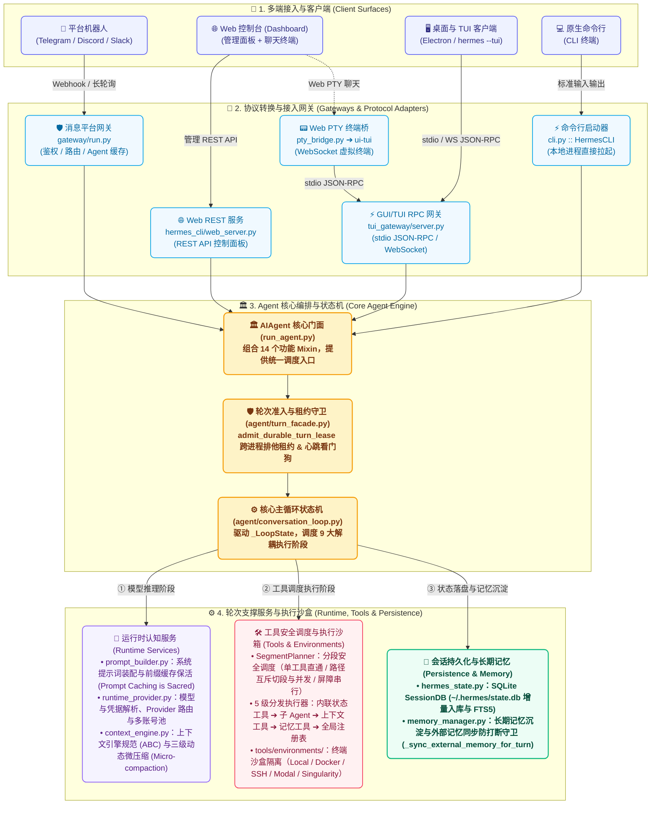
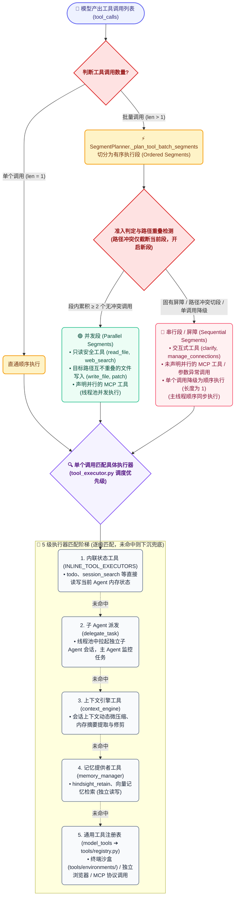

# Hermes Agent 项目架构与源码导航

> 核对日期：2026-09-24；源码基线：本地提交 `be8e2996cd`。本文是团队学习文档，不代表官方已发布文档同步更新。
> 阅读对象：有 Java 开发经验，正在熟悉 Python 与 Hermes 的读者。
> 起点：[官方中文架构页](https://hermes-agent.nousresearch.com/docs/zh-Hans/developer-guide/architecture)。本文根据本地源码重新组织说明；官方页面会继续变化，下面的差异仅针对本次查看的版本。

## 1. 从这里开始：先建立地图，再进入循环

这一章解决三个问题：**系统由哪些部分组成、一次请求经过哪里、遇到问题应该打开哪个文件**。不要求在这里读懂每个子系统的实现。

建议依次完成：

1. 阅读第 2 节，区分界面、接入层、Agent 核心和工具后端。
2. 阅读第 3 节，理解 Python 的“门面 + 同级模块”，并在 IDE 中找到对应目录。
3. 选择第 4 节的一条请求路径，边看图边到源码确认入口；第一次优先看通用 Agent 路径。
4. 用第 5 节的对照表区分容易混淆的概念。
5. 完成第 8 节定位练习，再进入[第一章：Agent Loop 学习步骤](<../01_Hermes Agent Loop 内部机制深度学习手册/agent_loop_internals_manual.md#learning-route>)。

> [!TIP]
> 🎨 **系统全景交互式可视化组件已就绪**：想要免去 Mermaid 的静态排版限制、体验丝滑无棱角的动态拓扑？可直接在浏览器中打开同目录下的 [`architecture_visualizer.html`](./architecture_visualizer.html)，支持按端（桌面/终端/机器人/Web）高亮全链路真实数据流、点击查看关键源码与防踩坑提示！

学习时先问“这个模块接收什么、负责什么、把结果交给谁”，不要试图先背目录树。图中的箭头表示主要调用或协作关系，不是严格时序，也不意味着每条路径都会经过所有节点。

## 2. 当前系统总览



### 2.1 多端架构的解耦与复用设计（同一套 Agent 核心如何适配多种形态？）

理解 Hermes 多端架构的关键在于看清它的**前后端分离与进程拓扑**：**TypeScript 前端只负责 UI 渲染与用户交互，Python 后端负责状态机、模型调用和沙盒工具执行**。甚至桌面端也可以通过网络连接远程服务器上的 Hermes 后端。

Hermes 针对不同使用场景，设计了四种形态各异却高度复用的接入方式：

| 接入形态 | 架构定位与通信协议 | 设计复用亮点与底层原理 | 源码核对入口 |
| :--- | :--- | :--- | :--- |
| **TUI (终端 UI)** | Node.js + Ink (React) 终端交互界面；通过 `stdio JSON-RPC` 与 Python 进程通信 | 极简无窗口依赖，原生终端字符渲染；通过标准输入输出传输轻量 JSON-RPC 协议帧，开销低且启动迅速 | [`tui_gateway/server.py`](../../../tui_gateway/server.py)<br/>[`ui-tui/`](../../../ui-tui/) |
| **Desktop (桌面客户端)** | Electron 独立跨平台应用；通过 WebSocket / HTTP RPC 连接 `hermes serve` 后端 | 纯正的原生 GUI 体验；前端采用 React + Nanostores，通过生成的强类型 RPC 契约与后端通信，支持连接本地或远程后端 | [`apps/desktop/`](../../../apps/desktop/)<br/>[`apps/shared/`](../../../apps/shared/) |
| **Dashboard (Web 控制台)** | 浏览器 Web 应用；管理功能走 FastAPI HTTP，对话终端走 Web PTY 桥接 | **精妙的双通道终端复用**：管理看板使用常规 REST API，而聊天控制台通过 Web PTY 直接挂载后端的真实 `ui-tui` 进程，一套终端代码多端复用！ | [`hermes_cli/web_server.py`](../../../hermes_cli/web_server.py)<br/>[`pty_bridge.py`](../../../hermes_cli/pty_bridge.py) |
| **Platform Bots (消息机器人)** | Telegram、Discord、Slack 等 ~20 个平台接入；由后台长驻守护进程驱动 | 独立于桌面的后台守护进程（Daemon）；在内存中维护跨轮次的 Agent 实例缓存池，即使关闭桌面客户端，机器人依然持续在线响应 | [`gateway/run.py`](../../../gateway/run.py)<br/>[`gateway/run_agent_cache.py`](../../../gateway/run_agent_cache.py) |

> [!NOTE]
> 💡 **快速解惑：TUI 是什么？是我在命令行直接敲 `hermes` 吗？**
> - **经典命令行 CLI（`hermes` 或 `hermes --cli`）**：纯 Python 运行环境（[`cli.py`](../../../cli.py)）。就像常规的 Bash 或 Python 交互终端，你输入一行需求按回车，模型回复一行行文字，屏幕向上自然滚动，轻量、原生。
> - **终端图形界面 TUI（`hermes --tui`）**：全称是 **Terminal User Interface**。它**不是简单的滚屏文字**，而是像 `Vim`、`htop` 或 `lazygit` 那样，**把你的终端窗口渲染成一个类似桌面软件的全屏控制台**（顶部有固定的 Agent 状态栏、底部有固定的快捷输入框、支持鼠标滚轮滚动、任务树折叠与彩色高亮）。它实际上是一个用 **Node.js + React (Ink 框架)** 编写的独立前端应用（位于 [`ui-tui/`](../../../ui-tui/)），在后台通过标准输入输出（stdio）与 Python 核心通信。
> - **Web Dashboard 的复用**：你在网页端看到的那个“终端小黑屋”，其实就是通过 Web PTY 虚拟终端在浏览器里跑了这个 `hermes --tui`！


## 3. 目录地图：公开入口不等于全部实现

### 3.1 Facade + siblings 是什么意思？

**Facade（门面）**提供对外入口；**siblings（同级模块）**在相同目录按主题实现具体工作。例如 `gateway/run.py` 与 `gateway/run_agent_cache.py` 是同级文件；后者负责 Agent 缓存相关行为。

对 Java 开发者，可以理解为“保留 Service 入口，把工作分给多个协作类”。Python 这里同时使用模块函数、Mixin 和延迟转发，不代表存在 Spring 容器或自动依赖注入。

```text
run_agent.py：AIAgent 对外类
  ├─ agent/agent_init.py：构造与初始化
  ├─ agent/turn_facade.py：轮次准入与清理
  ├─ agent/conversation_loop.py：轮次驱动与状态传递
  └─ agent/turn_*.py：请求、响应、重试、工具、收尾等阶段
```

`turn_*.py` 中的 `*` 表示一组文件，不是一个可以直接打开的文件名。找实现时先搜索函数定义或调用点；不必先通读门面的全部导入。Python 文件本身也是模块，函数不必放进类里。

### 3.2 按职责找文件

以下是阅读索引，不是完整文件清单；避免把工具数、平台数、测试数当作架构事实。

| 职责 | 当前源码入口 | 初学时先看什么 |
| :--- | :--- | :--- |
| 命令启动与经典 CLI | [hermes_cli/main.py](../../../hermes_cli/main.py)、[cli.py](../../../cli.py)、[cli_chat_turn_mixin.py](../../../hermes_cli/cli_chat_turn_mixin.py) | 命令如何进入一次聊天调用 |
| 核心 Agent | [run_agent.py](../../../run_agent.py)、[agent_init.py](../../../agent/agent_init.py)、[conversation_loop.py](../../../agent/conversation_loop.py) | 对象构造与单轮执行是不同阶段 |
| 提示词与缓存 | [system_prompt.py](../../../agent/system_prompt.py)、[prompt_builder.py](../../../agent/prompt_builder.py)、[prompt_caching.py](../../../agent/prompt_caching.py) | 首次构建、恢复已有前缀、请求格式处理的区别 |
| 模型与凭据解析 | [runtime_provider.py](../../../hermes_cli/runtime_provider.py)、[agent/auxiliary_client.py](../../../agent/auxiliary_client.py) | Provider、凭据池与 API 模式解析（流式与重试在 loop/turn 中） |
| 工具定义与执行 | [model_tools.py](../../../model_tools.py)、[toolsets.py](../../../toolsets.py)、[tools/registry.py](../../../tools/registry.py)、[agent/tool_executor.py](../../../agent/tool_executor.py) | 注册、可用性、会话工具选择、实际执行四件事 |
| 工具运行环境 | [tools/environments](../../../tools/environments/)、[tools/terminal_tool.py](../../../tools/terminal_tool.py)、[tools/mcp_tool.py](../../../tools/mcp_tool.py) | 命令在哪里执行，MCP 如何连接外部服务 |
| 会话存储 | [hermes_state.py](../../../hermes_state.py) 及 `hermes_state_*.py` | `SessionDB` 门面和消息/会话实现；SQLite 与 FTS5 |
| 长期记忆与上下文引擎 | [memory_manager.py](../../../agent/memory_manager.py)、[memory_provider.py](../../../agent/memory_provider.py)、[context_engine.py](../../../agent/context_engine.py) | 记忆编排器、MemoryProvider 与 ContextEngine(ABC) 规范接口 |
| 平台接入 | [gateway/run.py](../../../gateway/run.py)、[gateway/platforms](../../../gateway/platforms/)、[plugins/platforms](../../../plugins/platforms/) | 适配器、路由和 Agent 缓存；不能只在一个目录找平台 |
| RPC 与桌面/终端 | [tui_gateway/server.py](../../../tui_gateway/server.py)、[tui_gateway/contracts](../../../tui_gateway/contracts/)、[apps/shared](../../../apps/shared/) | 请求、响应、事件及生成的跨语言契约 |
| Web 管理服务 | [hermes_cli/web_server.py](../../../hermes_cli/web_server.py)、[web_routers](../../../hermes_cli/web_routers/)、[web](../../../web/) | 服务组装、按功能拆分的路由与前端 |
| 定时任务 | [cron/jobs.py](../../../cron/jobs.py)、[cron/scheduler.py](../../../cron/scheduler.py)、[scheduler_tick.py](../../../cron/scheduler_tick.py) | 任务状态、到期判断、执行和结果投递 |
| 插件与技能 | [hermes_cli/plugins.py](../../../hermes_cli/plugins.py)、[plugins](../../../plugins/)、[skills](../../../skills/)、[optional-skills](../../../optional-skills/) | 加载代码扩展与读取任务指南的区别 |
| IDE 与批处理 | [acp_adapter](../../../acp_adapter/)、[batch_runner.py](../../../batch_runner.py) | 不同入口如何复用核心能力 |
| 项目源码与用户状态边界 | [hermes_constants.py](../../../hermes_constants.py)、[agent/secret_scope.py](../../../agent/secret_scope.py) | profile 对应的路径和凭据作用域 |

### 3.3 依赖方向与执行方向不要看反

典型工具模块在加载时向注册表登记，`model_tools.py` 触发发现并收集定义，上层 Agent 再调用执行入口。这是组织依赖的方向；一次工具执行则从 Agent 向下进入调度和工具处理器。

注册了工具不代表所有会话都会收到它：还要经过配置、toolset、可用性等选择。插件和 MCP 的工具也有自己的加载或发现路径，不能把整个系统理解为只扫描 `tools/*.py`。

证据入口：[registry.py 的 `discover_builtin_tools`](../../../tools/registry.py)、[model_tools.py 的 `get_tool_definitions` / `handle_function_call`](../../../model_tools.py)。

## 4. 一次请求实际怎么走

### 4.1 通用 Agent 轮次：先学这一条

```mermaid
flowchart TD
    %% 样式与温润现代配色 (圆角柔和质感)
    classDef startNode fill:#EEF2FF,stroke:#6366F1,stroke-width:2px,color:#312E81,rx:8px,ry:8px;
    classDef gateNode fill:#F0F9FF,stroke:#0EA5E9,stroke-width:2px,color:#0369A1,rx:8px,ry:8px;
    classDef loopNode fill:#FEF3C7,stroke:#F59E0B,stroke-width:2px,color:#78350F,rx:8px,ry:8px;
    classDef decisionNode fill:#FEE2E2,stroke:#DC2626,stroke-width:2px,color:#991B1B,font-weight:bold,rx:8px,ry:8px;
    classDef endNode fill:#ECFDF5,stroke:#10B981,stroke-width:2px,color:#064E3B,font-weight:bold,rx:8px,ry:8px;

    Req(["🚀 调用方发起请求<br/>(AIAgent.run_conversation)"]):::startNode --> TurnFacade["🛡️ TurnFacade.run_conversation<br/>(admit_durable_turn_lease 租约准入 & 看门狗)"]:::gateNode
    TurnFacade --> Prep["⚙️ conversation_loop.py<br/>(构建上下文 & 恢复 Prompt 缓存前缀)"]:::loopNode
    Prep --> WhileLoop{"🔄 while 迭代主循环<br/>(API 请求 ➔ 异常重愈 ➔ 响应标准化)"}:::loopNode
    
    WhileLoop --> Decision{"🤔 模型响应类型?"}:::decisionNode
    
    Decision -- "🔧 返回 tool_calls" --> ToolRound["⚡ SegmentPlanner 工具安全执行<br/>(单个直接执行 / 批量切分并发与屏障)"]:::loopNode
    ToolRound -->|"携带工具结果回写历史"| WhileLoop
    
    Decision -- "💬 纯文本回答" --> FinishCheck{"finish_text_response<br/>是否确认正常完结?"}:::decisionNode
    
    FinishCheck -- "否: 空响应 / 思考链被截断需续写" -->|"继续生成"| WhileLoop
    FinishCheck -- "是: 回答应答完整" --> Finalize["💾 turn_finalizer.finalize_turn 轮次持久化收尾<br/>(SQLite 增量持久化 / 记忆同步守卫 / 后台审核)"]:::endNode
    
    Finalize --> Export(["📤 export_current_turn_boundary<br/>导出轮次边界 {turn_id, user_idx} 并交付结果"]):::startNode
```

```text
调用者获得或构造 AIAgent，提供当前输入与所需历史
  → TurnFacadeMixin.run_conversation：准入、作用域与清理边界
  → conversation_loop.run_conversation：轮次包装入口
  → _run_conversation_turn：构建上下文，恢复或构建提示词
  → while：准备消息 → 组装请求 → 预检 → API 调用/重试
      → 工具响应：执行工具，追加结果，再进入循环
      → 文本响应：通过终止检查，或恢复/续写后继续
  → 相应的收尾与结果返回
  → 调用方展示或投递；包装层导出轮次边界、执行清理
```

#### 4.1.1 关键生命周期与概念辨析

初学者在追踪 Agent Loop 执行流时，建议先厘清以下四个核心概念的边界：

- **Session vs. Turn vs. Iteration（从全局到局部的三层生命周期）**：
  - **Session（长对话会话）**：整个对话主题的全局生命周期（例如用户与 Agent 持续讨论某个项目的多天记录），在 SessionDB 中对应唯一的会话 ID。
  - **Turn（单轮交互）**：一次完整的“用户输入 ➔ Agent 交付最终答复”流程。Turn 是并发控制与持久化落盘的基本原子单位，受到跨进程租约保护。
  - **Iteration（轮内模型迭代）**：在同一个 Turn 内部，为了完成复杂任务，Agent 可能会多次向模型发起补全请求（例如：第 1 次迭代调用文件查找工具 ➔ 执行工具 ➔ 第 2 次迭代分析结果并调用编辑工具 ➔ 执行工具 ➔ 第 3 次迭代向用户给出最终说明）。这 3 次网络往返都属于同一个 Turn 的内部迭代。
- **系统提示词与缓存前缀复用**：
  - 系统提示词不是每一次迭代都推倒重构，而是优先复用已缓存的前缀。只有在首次启动、或发生故障转移切换 Provider 时，才会重新评估运行时。
- **增量持久化机制**：
  - 会话数据并非等整轮彻底结束后才一次性落盘，而是包含了增量写入和异常中断安全保存机制。

核对源码：[`turn_facade.py`](../../../agent/turn_facade.py)、[`conversation_loop.py`](../../../agent/conversation_loop.py)、[`turn_finalizer.py`](../../../agent/turn_finalizer.py)、[`runtime_provider.py`](../../../hermes_cli/runtime_provider.py)。详细逐段阅读放在第一章。

### 4.2 工具分发：不是所有工具都直接到注册表



#### 4.2.1 为什么需要分段规划？（消除常见的并发误解）

当大模型在一次回复中返回多个工具调用时，初学者很容易陷入两种极端的简单设想：
- **误解一：“所有工具一股脑并发执行”**：这极其危险。如果模型同时给出两个修改 `config.py` 的操作，并发会导致严重的写竞态（Race Condition）把代码改崩；如果包含向用户弹窗询问的交互工具（如 `clarify`），后台并发的写操作会在用户还没做出选择前胡乱执行。
- **误解二：“读操作并发，写操作全排队串行”**：这又过于保守低效。在真实的编程重构场景中，模型常常一次性生成或修改 3 个毫无关联的文件（例如同时创建 `src/a.py`、`src/b.py`、`tests/test_c.py`）。如果非要让写操作一个接一个排队，整体耗时会成倍增加。

Hermes Agent 的真实解决机制由 [`agent/tool_dispatch_helpers.py`](../../../agent/tool_dispatch_helpers.py) 中的 `_plan_tool_batch_segments` 驱动，其切段与执行规则如下：

1. **分段切分规则（Segment Splitting & Cut Boundary）**：
   - **固有串行屏障（Inherent Barriers）**：`_NEVER_PARALLEL_TOOLS`（如向用户发起提问的 `clarify`、网关连接变更 `manage_connections`）、未声明并行的外部 MCP 工具或参数无法解析的异常调用，不满足并行准入（`admission is None`）。它们会立即闭合当前段，自身作为串行屏障同步单发。
   - **路径重叠冲突切段（Path Conflict Cut）**：当写入工具与当前段已累积的路径存在写写冲突或读写冲突时（`_paths_overlap`），系统**在此处闭合当前段，并将该冲突调用作为全新段（New Run）的起点**。**关键点在于：路径冲突并不会导致后续所有调用全部退化为串行**！后续如果还有其他不冲突的工具调用，依然可以加入这个新段，在新段内再次并发执行！
2. **执行段模式（Parallel vs. Sequential）**：
   - **🟢 并发段（Parallel Segments）**：段内累积了 $\ge 2$ 个调用且无路径冲突（如只读工具 `read_file`/`web_search`、目标路径互不重叠的文件写入 `write_file`/`patch`、声明并行的 MCP 工具），提交给线程池并发执行。
   - **🔴 串行段（Sequential Segments）**：固有屏障调用，或者段内最终只有 1 个调用的情况（`len(current) == 1`），自动降级为顺序执行（以利用更完备的单调用内联调度与环境初始化），相邻的串行段会自动合并。

#### 4.2.2 5 级执行器路由匹配（工具并不是全部直接去注册表）

进入具体的工具执行阶段，并不是直接查一个全局字典。[`agent/tool_executor.py`](../../../agent/tool_executor.py) 会对工具名称严格按 **5 级优先级阶梯** 逐级匹配执行器：

1. **第 1 级：内核内联工具（`INLINE_TOOL_EXECUTORS`）**：
   - 包括 `todo`（任务看板维护）、`session_search`（历史会话检索）。
   - **特点**：它们需要直接操作 Agent 当前运行时的内部属性与内存状态，因此在 Agent 内核中就地执行。
2. **第 2 级：子 Agent 任务派发（`delegate_task`）**：
   - 在同进程的守护线程池（`DaemonThreadPoolExecutor`）中拉起独立的子 Agent 会话实例，主 Agent 在后台监控其任务进展。
   - **注意**：子 Agent 拥有独立的会话上下文（Session ID、角色提示词、迭代计数），但运行在同一 Python 进程的线程池中，并非操作系统级的新进程。
3. **第 3 级：上下文引擎工具（`context_engine`）**：
   - 触发会话上下文动态微压缩、内存摘要提取等上下文控制。
4. **第 4 级：长期记忆中枢工具（`memory_manager`）**：
   - 负责跨会话记忆读写（如 `hindsight_retain`、向量记忆检索）。
   - **注意**：轮次末的外部记忆自动镜像同步（`_sync_external_memory_for_turn`）受 Memory Sync Guard 严格保护（被打断轮次禁止自动同步），但轮内已执行的显式记忆写入工具不会在中断时自动回滚。
5. **第 5 级：通用外设工具注册表（`model_tools` ➔ `tools/registry.py`）**：
   - 上述 4 级均未命中的通用工具走此兜底入口。包括独立浏览器（`browser_tool.py`）、外部协议调用（`mcp_tool.py`），以及终端执行命令（经 `tools/environments/` 派发到 Local、Docker、SSH 或 Modal 云沙盒）。

### 4.3 平台机器人消息 vs. 桌面 GUI 消息：入口不同，核心高保真复用

在 Hermes 的设计中，无论是来自 Telegram 的手机消息，还是桌面 Electron 窗口里用户的打字输入，**底层驱动的都是同一个 Agent 核心**。但由于两者的交互范式完全不同，接入层做了针对性的架构分流：

1. **消息平台网关（[`gateway/`](../../../gateway/)）：长生命周期守护与实例缓存复用**
   - **交互特点**：机器人在后台作为守护进程 7x24 小时运行。用户可能在 Telegram 问了一句话，5 分钟后再回复第二句。
   - **Agent 缓存池（[`gateway/run_agent_cache.py`](../../../gateway/run_agent_cache.py)）**：网关不会为用户的每条消息都重新去初始化一遍整个 Agent，而是显式维护了一个带 TTL 淘汰机制的内存缓存池。这样既保留了活跃对话的热状态，又避免了频繁解析配置与加载插件的性能损耗。
2. **桌面/终端 RPC 网关（[`tui_gateway/`](../../../tui_gateway/)）：全双工交互与审批机制**
   - **交互特点**：GUI/TUI 拥有富交互界面，通信基于全双工协议（stdio 或 WebSocket）。
   - **三类消息流转**：
     - **客户端调用后端**：如用户发起提问、切换模型或清除历史；
     - **后端进度推送**：Agent 在思考、调用工具、生成文本时的流式实时事件；
     - **后端向用户发起审批/澄清**：当 Agent 准备执行危险命令或需要用户输入选择时，后端反向发起 `clarify` 弹窗请求，等待客户端确认并返回结果。

### 4.4 定时任务系统（Cron）：调度与执行的清晰解耦

Hermes 内置了强大的定时任务中枢（[`cron/`](../../../cron/)），它的设计极其灵活，支持两类截然不同的执行分支：

1. **智能体分析型任务（Agent Task）**：
   - 组装完整的上下文，拉起一个真实的 Agent 实例运行。适用于例如“每天早晨 9 点抓取 Hacker News 重点并发送简报到 Telegram”这类需要复杂大模型思考与工具调用的场景。
2. **轻量无智能体脚本任务（`no_agent` Task）**：
   - 直接在本地执行系统探测脚本或运维任务，**完全不需要创建 Agent 实例，零消耗大模型 Token**。
   - 执行完成后根据配置将输出投递到指定的通知目标（如控制台、指定会话或平台机器人）。

核对源码：[`cron/scheduler.py`](../../../cron/scheduler.py) 的 `run_job` 与 `no_agent` 分支、[`cron/scheduler_delivery.py`](../../../cron/scheduler_delivery.py)。

### 5.1 实战四维对照：Profile、Session、Turn、Process 究竟是什么？

很多读者看到文档里写的“`profile 是配置与凭据等隔离范围；不要误解为一个进程永远只对应一个 profile，或新 turn 必须新进程`”会非常困惑——**这到底体现在界面的哪？我在命令行怎么操作？它在硬盘和内存里到底是什么东西？**

我们通过一个四维对照表，彻底把它们拉回到真实的**操作、界面、文件与底层机制**中：

| 维度概念 | 用户怎么操作？（命令行与界面操作） | 屏幕上看到什么？（视觉呈现） | 硬盘上对应什么？（磁盘物理落盘） | 操作系统与内存里发生了什么？（底层核心机制） |
| :--- | :--- | :--- | :--- | :--- |
| **Profile**<br/>(身份/配置沙盒) | 终端输入：<br/>`hermes -p work chat`<br/>或桌面端右上角切换账户 | 两个彻底独立的工作环境（比如一个是“公司项目环境”，一个是“个人折腾环境”） | 独立的物理配置目录：<br/>• 默认环境：`~/.hermes/`<br/>• work 环境：`~/.hermes/profiles/work/`<br/>各自有专属的 `config.yaml`、`.env` 密钥与 `state.db`！ | **为什么说“一个进程不等于只对应一个 profile”？**<br/>当后台启动 `hermes serve`（为 Desktop 或 Web 提供后端服务的 RPC 守护进程）时，后台只有一个 Python 进程。但桌面端用户可以同时打开两个窗口——一个连接“工作 Profile”，一个连接“个人 Profile”。同一个 Python 进程在处理不同窗口发来的 RPC 请求时，通过 `_profile_runtime_scope` 动态切换对应的配置目录、`state.db` 数据库与密钥作用域，互不串味！ |
| **Session**<br/>(具体会话主题) | 桌面端点击“新建对话”；<br/>终端输入：<br/>`hermes --resume <session_id>`<br/>或聊天中输入 `/new`、`/resume <id>` | 桌面/Web 界面左侧历史列表里的某一条对话（如“重构订单模块”、“翻译技术文档”） | SQLite 数据库中的一个会话 ID：<br/>在 `~/.hermes/state.db`（或对应 Profile 的 `state.db`）的 `sessions` 表中存为一行主记录，`messages` 表存关联历史消息。 | 一个 Profile 下可以创建多个 Session。通过 `hermes --resume <id>` 或 `/resume <id>` 恢复会话时，后端无需重启，只是从 `state.db` 读出对应的历史消息灌入上下文。 |
| **Turn**<br/>(单轮交互原子) | 你在输入框打完一段需求，**按回车发送**，等待 Agent 回答完毕。 | 界面上完整的一来一回问答：<br/>【用户】你的提问<br/>【Agent】思考折叠块 ➔ 工具调用 ➔ 最终解答 | 增量追加写入 SQLite 消息表：<br/>这一轮的所有输入、中间工具调用与结果、模型最终回答落盘到 `state.db`。 | **为什么说“新 turn 不需要新进程”？**<br/>在交互式会话（CLI REPL、TUI、Desktop 或网关）中，后台的 Python 进程持续常驻运行。一个新 Turn 只是在已有进程中继续驱动主循环，并复用已加载的模型客户端、工具集合与提示词前缀，不需要为每个 Turn 重启或重新初始化进程。 |
| **Process**<br/>(操作系统进程) | 终端敲：<br/>`ps aux \| grep hermes`<br/>或查看 Mac 活动监视器 | 看到一个具体的操作系统 PID（如 PID 9527 运行着 `python3` 或 `node`） | 内存与 CPU 调度实体：<br/>占用 100MB 内存，持有着全局资源句柄（如数据库连接池、网络 Socket）。 | 它是所有代码运行的物理载体。一个后端进程可以长驻几个月，同时调度不同 Profile、不同 Session 下的上万次 Turn 交互。 |

### 5.2 核心机制与 Java 概念对标

| 概念 | 如何理解（Java 类比） | 避坑警示（不要误解为） |
| :--- | :--- | :--- |
| **模块 / Mixin / 门面** | Python 文件本身就是模块（装函数与类）；Mixin 是多重继承插拔逻辑；门面（如 `run_agent.py`）提供对外的统一调用入口（类似 Java Facade 模式） | 不要误以为每个 `.py` 都是一个 class 类，也不要有 Spring 容器自动注入的心智模型 |
| **`ContextEngine(ABC)`** | 类似 Java 的 `public abstract class ContextEngine`，定义上下文修剪与压缩的标准扩展契约 | 不要误以为压缩算法全部硬编码在主循环里；默认实现为 `ContextCompressor`，支持在 `plugins/context_engine/` 中插拔自定义引擎（如 LCM 等） |
| **tool schema vs. tool handler** | **Schema** 是告诉大模型的“接口说明书（JSON 格式）”；**Handler** 是真正的执行方法体（类似 Controller 映射的具体 Service 实现） | 不要以为 Schema 发给大模型就等于已经执行了；大模型只负责做决定，实际执行必须由 Python 本地调用 Handler |
| **skill / plugin / MCP** | **Skill** 是教大模型做事的人格与任务说明书（Markdown 文档）；**Plugin** 是增强系统能力的 Python 动态代码包；**MCP** 是连接外部数据库或微服务的标准通信协议 | 不要把三者混为一谈；给 Agent 灌知识用 Skill，写底层扩展用 Plugin，连外部现成服务用 MCP |
| **`with` / ContextVar** | 类似 Java 的 `ThreadLocal`，用来临时绑定当前线程/协程的作用域并在结束时自动恢复（如 Profile 隔离） | 不要当成普通的全局变量，它具备协程与函数调用栈级别的生命周期安全 |


## 6. 系统底层的四大设计哲学与架构不变量（为什么这样设计？）

在研读 Hermes Agent 源码时，如果不理解其底层的工程权衡，很容易对许多设计产生困惑（例如：“为什么系统提示词要这么死板？”、“为什么改配置不立刻生效？”、“为什么不在核心里多加几个好用的工具？”）。实际上，这些设计背后都紧扣着大模型工程的四大核心痛点：

### 6.1 提示词缓存神圣不可侵犯（Prompt Caching is Sacred）

- **痛点根源**：长上下文交互中，用户每多聊一轮，就需要把前面成千上万 Token 的全部历史再次上送给模型。如果不做优化，Token 费用将呈二次方暴涨，且首字延迟极高。现代主流大模型（Claude 3.5/3.7、GPT-4o、DeepSeek 等）提供了前缀缓存（Prefix Caching）机制：**只要请求开头的 Prompt 字节完全相同，即可命中缓存，享受 50%~90% 的费用减免与毫秒级首字响应**。
- **架构设计考量**：
  - **字节级绝对稳定**：Hermes 在会话期间严禁任意篡改或重建 System Prompt；工具声明的 JSON Schema 顺序也是绝对冻结的。
  - **变更延后生效机制（Deferred by Default）**：例如当用户执行 `/skills install` 安装新技能，或者通过命令修改系统配置时，Hermes 默认不会立即重新组装当前会话的 System Prompt（这会导致已有缓存前缀全部击穿报废），而是标记为“下一次新会话生效”，除非用户显式传入 `--now` 参数。
  - **动态上下文尾部追加**：对于“当前使用的客户端是桌面端还是终端”这类会随用户操作变化的上下文注记，Hermes 绝不会写在 System Prompt 头部，而是作为微注记动态追加在最后一条用户消息的末尾，确保长长的前缀依然可以 100% 命中缓存。

### 6.2 跨进程持久化轮次租约（Durable Multi-Process Turn Lease）

- **痛点根源**：Hermes 作为一个支持多端访问的个人 Agent，用户可能一边在手机 Telegram 上让它执行长耗时任务，一边在电脑桌面端打开了同一个会话；或者定时 Cron 任务同时触发。如果允许多个进程同时对同一个会话进行写入或调用大模型，就会发生严重的数据库死锁、历史消息角色交叉混乱（Role Alternation 破坏）。
- **架构设计考量**：
  - **排他租约锁（`admit_durable_turn_lease`）**：在 [`agent/turn_facade.py`](../../../agent/turn_facade.py) 中，任何一个入口发起对话轮次，都必须先向 SQLite 租约表申请排他执行锁。
  - **心跳看门狗（Heartbeat Watchdog）**：活跃的轮次在执行过程中会定期向租约写入心跳时间戳。如果进程意外崩溃断电，租约超时后会自动失效，防止出现永久死锁。
  - **后入排队与友好拒止**：后到达的并发请求会收到明确的“当前会话正在被其他客户端占用”的反馈，确保单会话严格串行安全。

### 6.3 长期记忆同步的防污染守卫（Memory Sync Guard）

- **痛点根源**：大模型生成代码或执行长链路思考时，经常会遇到用户中途按 `Ctrl+C` 强行打断，或者遭遇网络超时、API 报错。此时会话末尾留下的是半截未写完的残缺代码或错误的推理假设。如果后台把这些残缺数据一股脑自动同步进长期记忆向量库（如 Mem0/Zep），就会造成知识库的“永久性幻觉污染”。
- **架构设计考量**：
  - **轮次末自动镜像同步守卫（`_sync_external_memory_for_turn`）**：在 [`run_agent.py`](../../../run_agent.py) 与 [`agent/turn_finalizer.py`](../../../agent/turn_finalizer.py) 中，系统对轮次状态进行严格判定。只有正常圆满完结（`interrupted=False` 且通过终止校验）的轮次，才被允许触发向外部向量记忆后端的自动镜像同步与预取；一旦带有中断标记，外部记忆自动同步通道立即闭锁。
  - **明确保证边界**：需要说明的是，Memory Sync Guard 保护的是**轮次结束时的全局外部记忆自动同步与后台记忆审核**。如果模型在轮次执行中途通过显式工具调用（如 `save_memory`）写入了数据，该工具已执行完毕，并不会在中断时被撤销回滚。

### 6.4 窄腰架构（Narrow Waist）：核心极度克制，能力全部放边缘

- **痛点根源**：很多初学者会想：“为什么 Hermes 核心工具这么少？为什么不把网页爬虫、数据库连接、邮件发送都做成核心自带工具？”在大模型时代，**每一个声明的核心工具（Tool Schema），无论用不用，都必须在每一次 API 请求中完整发送**。如果把上百个工具塞进核心，单次调用的 Prompt 开销将达上万 Token，模型也极易因参数太多而产生幻觉（Tool Confusion）。
- **架构设计考量（能力层级阶梯）**：
  - **窄腰核心（The Narrow Waist）**：核心只保留最底层的原子工具（`terminal` 终端命令执行、`read_file`/`write_file` 文件读写）。
  - **边缘展开（Capabilities at the Edges）**：
    - 绝大部分日常需求，优先通过 **“CLI 命令行 + Skill 任务指南”** 解决。例如管理定时任务，不是给大模型加一个 `create_cron_tool`，而是让大模型在终端里敲 `hermes cron add` 命令，核心工具开销为零！
    - 垂直领域需求，通过 **动态按需挂载的 MCP 服务**（如连接 Notion、Postgres）或 **Plugin 插件** 扩展，随用随连。

### 6.5 Profile 深度多租户隔离（超越单纯的目录隔离）

- **痛点根源**：一个 Hermes 常驻后台可以同时挂载“个人 Profile”与“工作 Profile”。如果只简单地把配置文件放在不同文件夹，那么在同一个 Python 进程中，全局环境变量（如 `GITHUB_TOKEN`、`OPENAI_API_KEY`）和终端 SSH 认证信息就会发生串味泄露。
- **架构设计考量**：
  - **上下文变量沙盒绑定**：Hermes 通过 Python 的 `ContextVar` 机制，在轮次开始时进入 `_profile_runtime_scope` 作用域上下文。不仅数据路径隔离（[`hermes_constants.py`](../../../hermes_constants.py) 的 `get_hermes_home()`），凭据作用域（`secret_scope`）与子进程环境变量也被深度隔离，确保多用户/多配置之间的严格安全性。

## 7. 架构演进观察：官方文档与现代代码的版本变迁

学习开源项目时，最让人头疼的就是“文档写的内容和当前最新代码对不上”。为了帮助你消除这种困惑，这里整理了一份**官方中文早期文档与当前重构后代码的演变对照表**，让你清楚地看到 Hermes 是如何演进的：

| 官方早期文档表述 | 当前现代源码实际状态 (2026-09) | 架构演进意图与核对入口 |
| :--- | :--- | :--- |
| 将核心逻辑描述为几个数千行的“巨型单文件” (`run_agent.py`、`conversation_loop.py`) | **重构为“门面 (Facade) + 领域同级模块 (Siblings)”** | 拆分为细粒度模块（如 9 个 `turn_*.py` 阶段），降低单个文件圈复杂度，提升可测试性。<br/>核对：[`run_agent.py`](../../../run_agent.py)、[`agent/`](../../../agent/) |
| 顶层架构图仅粗略展示“GUI” | **细分为 stdio RPC (TUI)、WebSocket RPC (Desktop)、PTY 终端桥 (Dashboard)** | 明确了不同客户端与后端的真实网络协议与进程拓扑。<br/>核对：[`tui_gateway/server.py`](../../../tui_gateway/server.py)、[`hermes_cli/web_server.py`](../../../hermes_cli/web_server.py) |
| 平台机器人集中列在 `gateway/platforms/` | **解耦为内置核心平台 + `plugins/platforms/` 插件生态** | 核心保持克制，更多第三方平台（如 Lark、Matrix）作为插件动态加载。<br/>核对：[`gateway/platforms/`](../../../gateway/platforms/)、[`plugins/platforms/`](../../../plugins/platforms/) |
| 工具调用被粗略描述为“只读并发、写入全串行” | **细化为 `SegmentPlanner` 分段规划：路径互斥可并发写，冲突与交互立起串行屏障** | 兼顾文件并发写入的极致性能与写入一致性安全。<br/>核对：[`agent/tool_dispatch_helpers.py`](../../../agent/tool_dispatch_helpers.py) |
| 文本回复直接视为会话结束 | **补充 `finish_text_response` 截断与空响应自愈重试环** | 防止模型因思考链（Reasoning）过长被截断而输出残缺答复。<br/>核对：[`agent/turn_text_finish.py`](../../../agent/turn_text_finish.py) |
| 定时任务描述为统一创建 Agent 运行 | **支持 `no_agent` 纯脚本执行分支** | 轻量级探测与定时脚本无需创建 Agent，零消耗大模型 Token。<br/>核对：[`cron/scheduler.py`](../../../cron/scheduler.py) |

## 8. 架构理解检验：三道源码溯源思考题

在学完本章的全景地图后，尝试在本地 IDE 中找到以下三个实战场景的源码入口，检验自己是否真正掌握了架构拓扑：

1. **场景一：桌面端能正常聊天，但大模型不知道自己处于桌面环境**
   - *思考*：应该先检查前端传来的平台环境参数与 toolset 集合，还是直接去修改全局 System Prompt？
   - *源码线索*：定位 [`toolsets.py`](../../../toolsets.py) 与 [`tui_gateway/server.py`](../../../tui_gateway/server.py)，观察 GUI 专属能力是如何按会话来源动态打包进 toolset 的。
2. **场景二：本地新写了一个工具并在注册表登记，但在当前会话中大模型始终看不到它**
   - *思考*：工具从被 Python 导入到真正出现在大模型的 `tools` 参数列表中，中间经过了哪些过滤闸门？
   - *源码线索*：梳理“`tools/registry.py` (注册) ➔ 可用性探测 (`check_fn`) ➔ `toolsets.py` (会话启用) ➔ `model_tools.py` (生成 JSON Schema)”这一完整链条。
3. **场景三：希望为系统接入一个新的第三方向量记忆库（如 Pinecone 或 Qdrant）**
   - *思考*：是应该直接在核心循环 `conversation_loop.py` 里写 `if/elif` 分支，还是通过标准插件接口接入？
   - *源码线索*：查看 [`agent/memory_provider.py`](../../../agent/memory_provider.py) 抽象基类与 [`plugins/memory/`](../../../plugins/memory/) 插件机制，理解“扩展在边缘、核心零污染”的真正含义。

---

## 9. 开启专题精读之路

掌握了这幅系统全景地图后，你已经具备了在 Hermes Agent 源码中穿梭自如的基础能力。接下来，请正式进入我们的第一门实战精读专题：

👉 **[下一章：01_Hermes Agent Loop 内部机制深度学习手册](<../01_Hermes Agent Loop 内部机制深度学习手册/agent_loop_internals_manual.md>)**

在第一章中，我们将带你深入 [`agent/conversation_loop.py`](../../../agent/conversation_loop.py) 与 [`agent/turn_*.py`](../../../agent/)，逐行剖析单轮交互的 9 大解耦阶段与真实状态机的流转秘密！
