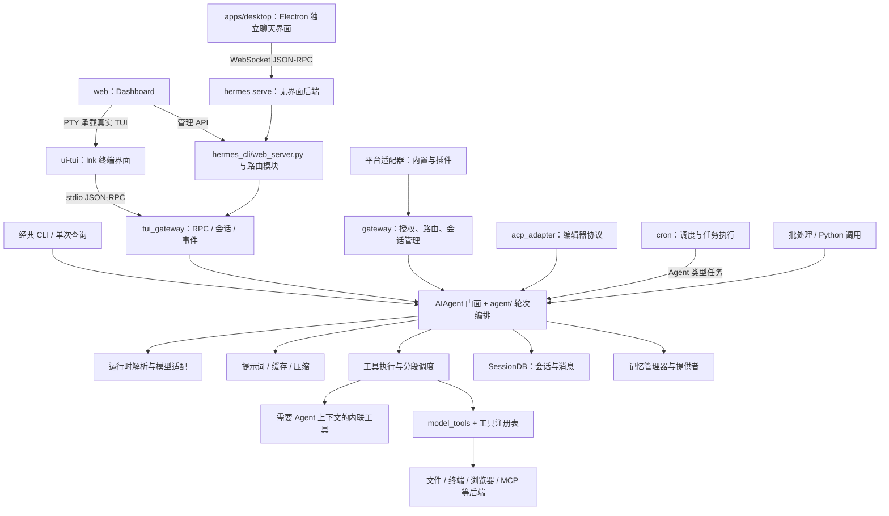

# Hermes Agent 项目架构与源码导航

> 核对日期：2026-09-24；源码基线：本地提交 `be8e2996cd`。本文是团队学习文档，不代表官方已发布文档同步更新。
> 阅读对象：有 Java 开发经验，正在熟悉 Python 与 Hermes 的读者。
> 起点：[官方中文架构页](https://hermes-agent.nousresearch.com/docs/zh-Hans/developer-guide/architecture)。本文根据本地源码重新组织说明；官方页面会继续变化，下面的差异仅针对本次查看的版本。

## 1. 从这里开始：先建立地图，再进入循环

这一章解决三个问题：**系统由哪些部分组成、一次请求经过哪里、遇到问题应该打开哪个文件**。不要求在这里读懂每个子系统的实现。

建议依次完成：

1. 阅读第 2 节，区分界面、接入层、Agent 核心和工具后端。
2. 阅读第 3 节，理解 Python 的“门面 + 同级模块”，并在 IDE 中找到对应目录。
3. 选择第 4 节的一条请求路径，边看图边到源码确认入口；第一次优先看通用 Agent 路径。
4. 用第 5 节的对照表区分容易混淆的概念。
5. 完成第 8 节定位练习，再进入[第一章：Agent Loop 学习步骤](<../01_Hermes Agent Loop 内部机制深度学习手册/agent_loop_internals_manual.md#learning-route>)。

学习时先问“这个模块接收什么、负责什么、把结果交给谁”，不要试图先背目录树。图中的箭头表示主要调用或协作关系，不是严格时序，也不意味着每条路径都会经过所有节点。

## 2. 当前系统总览



这里最重要的边界是：**TypeScript 界面负责显示与交互，Python 后端负责会话、模型调用和工具执行**。桌面客户端也可能连接远程后端，不能从客户端在本机就推断工具也在本机执行。

### 三种界面不要混为一谈

| 界面 | 当前主要结构 | 去哪里核对 |
| :--- | :--- | :--- |
| TUI | `ui-tui/` 中的 Node/Ink 界面，经 stdio JSON-RPC 连接 Python | [tui_gateway/AGENTS.md](../../../tui_gateway/AGENTS.md)、[server.py](../../../tui_gateway/server.py) |
| Desktop | Electron 自己的聊天界面，经共享客户端访问 `hermes serve` 后端；不是内嵌 TUI | [桌面后端契约](../../../apps/desktop/src/AGENTS.md)、[apps/shared](../../../apps/shared/) |
| Dashboard | 浏览器聊天页用 PTY 嵌入真实 TUI；管理页面由 Web 前端与 HTTP 路由提供 | [web/AGENTS.md](../../../web/AGENTS.md)、[pty_bridge.py](../../../hermes_cli/pty_bridge.py) |

`serve` 与 `dashboard` 复用服务器组装代码，但前者是无界面后端，不依赖 Dashboard 前端构建。消息平台的长期运行 gateway 又是另一种生命周期，不能把关闭桌面等同于停止所有机器人。

## 3. 目录地图：公开入口不等于全部实现

### 3.1 Facade + siblings 是什么意思？

**Facade（门面）**提供对外入口；**siblings（同级模块）**在相同目录按主题实现具体工作。例如 `gateway/run.py` 与 `gateway/run_agent_cache.py` 是同级文件；后者负责 Agent 缓存相关行为。

对 Java 开发者，可以理解为“保留 Service 入口，把工作分给多个协作类”。Python 这里同时使用模块函数、Mixin 和延迟转发，不代表存在 Spring 容器或自动依赖注入。

```text
run_agent.py：AIAgent 对外类
  ├─ agent/agent_init.py：构造与初始化
  ├─ agent/turn_facade.py：轮次准入与清理
  ├─ agent/conversation_loop.py：轮次驱动与状态传递
  └─ agent/turn_*.py：请求、响应、重试、工具、收尾等阶段
```

`turn_*.py` 中的 `*` 表示一组文件，不是一个可以直接打开的文件名。找实现时先搜索函数定义或调用点；不必先通读门面的全部导入。Python 文件本身也是模块，函数不必放进类里。

### 3.2 按职责找文件

以下是阅读索引，不是完整文件清单；避免把工具数、平台数、测试数当作架构事实。

| 职责 | 当前源码入口 | 初学时先看什么 |
| :--- | :--- | :--- |
| 命令启动与经典 CLI | [hermes_cli/main.py](../../../hermes_cli/main.py)、[cli.py](../../../cli.py)、[cli_chat_turn_mixin.py](../../../hermes_cli/cli_chat_turn_mixin.py) | 命令如何进入一次聊天调用 |
| 核心 Agent | [run_agent.py](../../../run_agent.py)、[agent_init.py](../../../agent/agent_init.py)、[conversation_loop.py](../../../agent/conversation_loop.py) | 对象构造与单轮执行是不同阶段 |
| 提示词与缓存 | [system_prompt.py](../../../agent/system_prompt.py)、[prompt_builder.py](../../../agent/prompt_builder.py)、[prompt_caching.py](../../../agent/prompt_caching.py) | 首次构建、恢复已有前缀、请求格式处理的区别 |
| 模型与凭据路由 | [runtime_provider.py](../../../hermes_cli/runtime_provider.py)、[agent/auxiliary_client.py](../../../agent/auxiliary_client.py) | 主模型解析与辅助任务的解析入口 |
| 工具定义与执行 | [model_tools.py](../../../model_tools.py)、[toolsets.py](../../../toolsets.py)、[tools/registry.py](../../../tools/registry.py)、[agent/tool_executor.py](../../../agent/tool_executor.py) | 注册、可用性、会话工具选择、实际执行四件事 |
| 工具运行环境 | [tools/environments](../../../tools/environments/)、[tools/terminal_tool.py](../../../tools/terminal_tool.py)、[tools/mcp_tool.py](../../../tools/mcp_tool.py) | 命令在哪里执行，MCP 如何连接外部服务 |
| 会话存储 | [hermes_state.py](../../../hermes_state.py) 及 `hermes_state_*.py` | `SessionDB` 门面和消息/会话实现；SQLite 与 FTS5 |
| 长期记忆与上下文引擎 | [memory_manager.py](../../../agent/memory_manager.py)、[memory_provider.py](../../../agent/memory_provider.py)、[context_engine.py](../../../agent/context_engine.py) | 编排器与提供者接口的职责 |
| 平台接入 | [gateway/run.py](../../../gateway/run.py)、[gateway/platforms](../../../gateway/platforms/)、[plugins/platforms](../../../plugins/platforms/) | 适配器、路由和 Agent 缓存；不能只在一个目录找平台 |
| RPC 与桌面/终端 | [tui_gateway/server.py](../../../tui_gateway/server.py)、[tui_gateway/contracts](../../../tui_gateway/contracts/)、[apps/shared](../../../apps/shared/) | 请求、响应、事件及生成的跨语言契约 |
| Web 管理服务 | [hermes_cli/web_server.py](../../../hermes_cli/web_server.py)、[web_routers](../../../hermes_cli/web_routers/)、[web](../../../web/) | 服务组装、按功能拆分的路由与前端 |
| 定时任务 | [cron/jobs.py](../../../cron/jobs.py)、[cron/scheduler.py](../../../cron/scheduler.py)、[scheduler_tick.py](../../../cron/scheduler_tick.py) | 任务状态、到期判断、执行和结果投递 |
| 插件与技能 | [hermes_cli/plugins.py](../../../hermes_cli/plugins.py)、[plugins](../../../plugins/)、[skills](../../../skills/)、[optional-skills](../../../optional-skills/) | 加载代码扩展与读取任务指南的区别 |
| IDE 与批处理 | [acp_adapter](../../../acp_adapter/)、[batch_runner.py](../../../batch_runner.py) | 不同入口如何复用核心能力 |
| 项目源码与用户状态边界 | [hermes_constants.py](../../../hermes_constants.py)、[agent/secret_scope.py](../../../agent/secret_scope.py) | profile 对应的路径和凭据作用域 |

### 3.3 依赖方向与执行方向不要看反

典型工具模块在加载时向注册表登记，`model_tools.py` 触发发现并收集定义，上层 Agent 再调用执行入口。这是组织依赖的方向；一次工具执行则从 Agent 向下进入调度和工具处理器。

注册了工具不代表所有会话都会收到它：还要经过配置、toolset、可用性等选择。插件和 MCP 的工具也有自己的加载或发现路径，不能把整个系统理解为只扫描 `tools/*.py`。

证据入口：[registry.py 的 `discover_builtin_tools`](../../../tools/registry.py)、[model_tools.py 的 `get_tool_definitions` / `handle_function_call`](../../../model_tools.py)。

## 4. 一次请求实际怎么走

### 4.1 通用 Agent 轮次：先学这一条

```text
调用者获得或构造 AIAgent，提供当前输入与所需历史
  → TurnFacadeMixin.run_conversation：准入、作用域与清理边界
  → conversation_loop.run_conversation：轮次包装入口
  → _run_conversation_turn：构建上下文，恢复或构建提示词
  → while：准备消息 → 组装请求 → 预检 → API 调用/重试
      → 工具响应：执行工具，追加结果，再进入循环
      → 文本响应：通过终止检查，或恢复/续写后继续
  → 相应的收尾与结果返回
  → 调用方展示或投递；包装层导出轮次边界、执行清理
```

几个阅读边界：

- Provider 解析和 Agent 初始化不是每次模型迭代都必然重做；故障转移等路径才可能重新调整运行时。
- 持续会话会尝试恢复既有提示词前缀，不能把 `build_system_prompt` 画成每次迭代必经的重新构建步骤。
- 消息持久化不是仅在“最终回答显示后”才发生；存在增量写入及提前退出处理。
- API 调用有内层重试；一次用户输入也可能有多轮工具调用。session、turn、iteration 和网络请求次数不是同一概念。
- 当前存在 `codex_app_server` 专用运行时分支及回退，不能把三种常见 API 格式说成所有执行路径的完整列表。

核对：[turn_facade.py](../../../agent/turn_facade.py)、[conversation_loop.py](../../../agent/conversation_loop.py)、[turn_finalizer.py](../../../agent/turn_finalizer.py)、[runtime_provider.py](../../../hermes_cli/runtime_provider.py)。详细逐段阅读放在第一章。

### 4.2 工具分发：不是所有工具都直接到注册表

模型返回的是“工具名称和参数”，不是直接替你执行操作。Agent 解析调用、应用执行约束，并把结果组织成后续模型请求中的工具消息。

[agent/tool_executor.py](../../../agent/tool_executor.py) 对部分需要当前 Agent 状态的工具使用 [INLINE_TOOL_EXECUTORS](../../../agent/inline_tool_executors.py)；其他调用可进入 `model_tools.handle_function_call`。因此排查工具问题时，要先查它实际走哪条路径。

批量工具调用的分段规划见 [tool_dispatch_helpers.py](../../../agent/tool_dispatch_helpers.py) 的 `_plan_tool_batch_segments`。路径不冲突的写入也可能并发；涉及写入的路径冲突会切分当前段，交互工具等调用形成串行屏障。“所有工具并发”和“所有写入串行”都过于简单。

### 4.3 平台消息与 GUI 消息：入口不同，核心可复用

平台消息经适配器进入 gateway，由接入层处理授权、会话路由及相应 profile 范围，再创建或复用 Agent，调用核心并回传结果。Agent 缓存已经是显式子系统，不能预设每条消息都新建 Agent；见 [run_agent_cache.py](../../../gateway/run_agent_cache.py)。

TUI/Desktop 则经 `tui_gateway` 的 RPC 与事件协议访问后端。消息平台 gateway 与 GUI RPC 后端名字相似，但不是同一层。Python 的契约定义见 [tui_gateway/contracts](../../../tui_gateway/contracts/)，TypeScript 客户端与生成类型见 [apps/shared](../../../apps/shared/)。

阅读 GUI 时先区分三种消息：客户端发起的方法调用、后端发布的进度事件、后端向用户发起的审批/澄清请求。最后一种需要用户回复，并非只有服务器单向推送。

### 4.4 定时任务：调度和执行分开看

```text
扫描到期任务 → 确定任务归属与执行条件 → 执行相应任务分支
  → Agent 任务：组装任务上下文并运行 Agent
  → no_agent 脚本任务：直接执行脚本，不创建 Agent
  → 记录结果与状态，按配置投递，更新后续调度
```

源码中有 `no_agent` 分支，所以“cron 永远是模型任务”不成立；也不要把所有定时任务都视为恢复当前聊天。会话、投递目标与 Bot Chat 等行为取决于具体任务路径和配置。

核对：[scheduler.py](../../../cron/scheduler.py) 的 `run_job` 和 `no_agent` 分支、[scheduler_delivery.py](../../../cron/scheduler_delivery.py)、[scheduler_provider.py](../../../cron/scheduler_provider.py)。

## 5. Java 开发者最容易混淆的边界

| 概念 | 如何理解 | 不要误解为 |
| :--- | :--- | :--- |
| 模块 / Mixin / 门面 | 文件模块装函数和类；Mixin 通过继承提供实现；门面提供公开入口 | 每个 `.py` 都是一个 Java 类，或 Mixin 就是 Spring Bean |
| `ContextEngine(ABC)` | 抽象基类定义扩展协议，可借助接口/抽象类理解 | 所有实现都硬编码在核心循环 |
| tool schema / tool handler | 前者描述模型如何调用，后者执行实际工作 | schema 被发给模型就表示已执行工具 |
| skill / plugin / MCP | skill 是任务指导；plugin 是运行时代码扩展；MCP 是外部工具服务连接协议 | 三者是同一个插件文件格式 |
| provider / model / API mode | 服务与凭据路由、模型标识、通信适配方式是不同维度 | 更换模型名字必然更换整套 API 协议 |
| SessionDB / 长期记忆 | 会话消息与运行状态，对比经过提炼或提供者管理的长期信息 | 保存聊天记录就等于完成长期记忆提炼 |
| profile / session / process | profile 是配置与凭据等隔离范围；session 是对话身份；process 是运行载体 | 一个进程永远只对应一个 profile，或新 turn 必须新进程 |
| `with` / ContextVar | 可用来临时绑定作用域并恢复，有点像受控的请求上下文 | 普通全局变量，或天然跨任意线程正确传播 |

Python 的函数也是对象，既能作为回调传递，也能被字典保存。看到注册表和表驱动分发时，可以先类比 Java 的 `Map<String, Handler>`；但 `_run_phase` 按参数名读状态的机制需要另学，第一章已有逐句展开。

## 6. 当前架构必须保留的约束

### 稳定的会话前缀

持续会话依赖稳定的提示词和工具前缀。不能为了新增功能随意重写已发送历史或在轮次中途重建系统提示词；上下文压缩是明确例外。会影响提示词状态的命令需遵循项目的延后生效与显式即时应用机制。前缀稳定是缓存复用的条件，不是对服务商实际缓存命中率的保证。

### 消息结构与持久化一致性

工具调用和工具结果需要正确配对；中断、重试、压缩都不能让持久化历史与实际请求任意分叉。不要将“严格角色顺序”简单理解为只允许 user/assistant 两个角色，工具消息和 `/steer` 有各自合法位置。

### Profile 不能只隔离一个目录

同一后端进程可能服务多个 profile。配置路径、凭据、终端作用域必须按当前归属一起绑定；后台回调、会话清理、RPC 和定时任务也要遵守这一点。代码应使用 `get_hermes_home()` 等项目接口，不能硬编码默认用户目录，也不能把进程启动环境当作所有会话的配置。

详见 [profile 隔离说明](../../../website/docs/user-guide/multi-profile-gateways.md) 与 [gateway 开发约束](../../../gateway/AGENTS.md)。

### 能力放在合适的边界

能扩展现有实现就先扩展；用户特定能力优先考虑 CLI + skill、受配置控制的工具、插件或 MCP，不默认增加每次模型请求都携带的核心工具。GUI 专属能力按会话来源选择 toolset；进程级 `check_fn` 不适合判断“当前是不是桌面用户”。

开发前读对应目录的 `AGENTS.md`。本章帮助定位，不替代这些具体约束。

## 7. 对官方中文架构页的补充与修正

以下为本次对照结果。官方顶层的“多入口复用核心”仍然适用；变化主要在文件归属、入口拓扑与不能省略的分支。不是所有官方文档都同时过时，例如本地英文架构页已更新了部分门面和平台插件描述。

| 查看官方中文页时的不足 | 本文采用的当前说明 | 本地核对位置 |
| :--- | :--- | :--- |
| 目录仍以多个“大文件”解释核心 | 门面保留公开入口，主题实现迁入同级模块；按符号找实现 | `run_agent.py`、`agent/conversation_loop.py`、根 `AGENTS.md` |
| 顶层图未充分展示 TUI/Desktop/Dashboard | 分别说明 stdio RPC、桌面 WS RPC、Dashboard PTY | `tui_gateway/AGENTS.md`、`apps/desktop/src/AGENTS.md`、`web/AGENTS.md` |
| 平台列表集中指向 `gateway/platforms/` | 同时检查内置目录与 `plugins/platforms/` | 两个目录的实际文件 |
| 用三种 API 模式概括全部执行 | 常见适配之外还有专用运行时分支 | `runtime_provider.py`、`conversation_loop.py` |
| 工具路径仅列通用分发 | 补充内联工具、toolset 与注册表之间的边界 | `tool_executor.py`、`inline_tool_executors.py` |
| Gateway 消息路径只写创建 Agent | 补充缓存、复用与清理 | `gateway/run_agent_cache.py` |
| Cron 流程只展示 Agent 任务 | 补充 `no_agent` 脚本路径及投递边界 | `cron/scheduler.py` |
| 固定平台/工具/测试数量 | 不用易变计数定义架构 | 各注册表、配置与源码目录 |

## 8. 学完后应具备什么能力

做三个不需要 API 的定位练习：

1. **桌面能聊天，模型却看不到桌面工具**：应先查会话来源、toolset 选择和 RPC 能力边界，还是修改模型提示词？说出理由，并找到两个对应入口。
2. **工具已经注册，但当前会话没有这个工具**：画出“注册 → 可用性/配置 → 会话选择 → schema”的关系。解释为什么注册成功不足以证明会话可用。
3. **新增记忆后端**：指出应从哪个接口与编排器开始读，而不是直接向 `conversation_loop.py` 添加供应商分支。

参考定位：① `toolsets.py`、GUI 后端会话及工具解析代码；不能只用桌面进程环境推断会话能力。② `tools/registry.py`、`model_tools.py` 和会话配置入口。③ `agent/memory_provider.py`、`agent/memory_manager.py` 及插件规范。

本章完成清单：

- [ ] 能画出界面/接入层 → Agent 核心 → 模型与工具 → 状态存储的关系。
- [ ] 能解释 Desktop、Dashboard、TUI 和消息平台 gateway 的区别。
- [ ] 能按需求找到对应目录及函数入口，而不通读门面大文件。
- [ ] 能区分会话存储和长期记忆、工具和技能、profile 和进程。
- [ ] 能指出简化数据流中的两个例外，例如内联工具、专用运行时或脚本任务。
- [ ] 完成上述三个定位练习，并能用自己的话解释原因。

完成后进入[第一章阅读路线](<../01_Hermes Agent Loop 内部机制深度学习手册/agent_loop_internals_manual.md#learning-route>)，学习怎样追踪具体一轮请求。提示词、并发规划、压缩和持久化的细节放到后续专题。

## 9. 维护这张架构地图

源码更新后先记录新提交，再核对：入口是否迁移、函数实际定义在哪、跨进程协议是否变化、平台或能力是否迁到插件。更新链接和示意图，不靠修改“当前数量”假装完成同步。

文档目录分工：`docs/learning/` 保存团队学习材料；`项目学习与代码协作规范手册.md` 保存协作约定与学习入口；`website/` 是官方文档站的源码。本文独立存放，避免在协作规范中重复维护整套架构。
