# Hermes Agent Loop 内部机制深度学习手册

> 如果还不清楚项目整体分层，先读[第 00 章：项目架构与源码导航](<../00_项目架构与源码导航/architecture.md>)，再回到本章跟踪一次请求。

> **版本适用范围**：Hermes Agent 2026.9+ 架构（已完成 15k 行 God-File 解耦与 Facade + Siblings 拓扑改造）  
> **核心源码定位**：
> - 接口外观：`../../../run_agent.py`（Facade 入口与功能 Mixin）
> - 轮次准入门禁：`../../../agent/turn_facade.py`（Turn Lease 跨进程租约管理）
> - 对话主循环驱动：`../../../agent/conversation_loop.py`（`_LoopState` 状态容器与阶段调度器）
> - 阶段处理组件：`agent/turn_*.py`（`turn_iteration_prep.py`, `turn_api_call.py`, `turn_tool_round.py`, `turn_finalizer.py` 等）


> **第一次读请从[第 6 节：学习步骤与完成标准](#learning-route)开始**，再按步骤回到对应章节和源码。
>
> **Java 开发者阅读方式**：本章把 Python 语法放在对应机制旁边讲。先读第 2 节的“语法伴读 A—C”，理解方法从哪里来、状态如何传递；再跟第 3 节走一遍正常路径。标为“源码节选”的块省略了上下文，不要整块复制运行；标为“可独立运行”的例子只使用标准库，不请求模型、不读取用户配置。
> 本次语法说明对照本地 `be8e2996cd` 版本源码核对；后续源码更新时，优先按函数名查找，不依赖行号。

---

## 1. 架构演进背景：从单文件到分模块

此前的中文文档曾将核心描述为（这份本地文档也在更新，请以当前源码为准）：
> *“核心编排引擎是 run_agent.py 中的 AIAgent 类——这是一个大型文件（15k+ 行），负责处理从 prompt 组装到工具分发再到 provider 故障转移的所有逻辑。”*

**事实澄清（2026 年 9 月重大重构）**：
在 2026 年 9 月的架构治理中，Hermes 项目完成了全方位的 **God-File 拆分工程**（参见 `../../../AGENTS.md` 中的 *Facade + siblings layout* 规范）。
1. **旧状态**：原 `../../../run_agent.py` 膨胀至 15,000+ 行，数百个局部变量在单一函数内交织，修改任何细微逻辑都极易破坏上下文缓存、消息交替和故障转移链路。
2. **新拓扑**：
   - `../../../run_agent.py` 改为 **Facade 门面**，组合了 `agent/` 下的多个专用功能 Mixin（记忆管理、客户端初始化、工具注册、会话压缩等）。
   - 核心会话轮次准入门禁被下沉到 `../../../agent/turn_facade.py`。
   - 实际的单轮驱动循环被重构为 `../../../agent/conversation_loop.py`，采用 **`_LoopState` 状态机容器 + `_run_phase` 反射式阶段注入机制**。
   - 每个执行阶段被独立拆分为 `agent/turn_*.py` 单一职责模块。

---

## 2. 现代 Agent Loop 模块拓扑与职责划分

现代架构形成了清晰的“分层门禁 - 状态机驱动 - 阶段化处理 - 边界导出”拓扑结构：

```mermaid
flowchart TD
    %% 节点样式定义 (高对比度现代配色)
    classDef userNode fill:#4F46E5,stroke:#3730A3,stroke-width:2px,color:#FFFFFF,font-weight:bold;
    classDef facadeNode fill:#0284C7,stroke:#0369A1,stroke-width:2px,color:#FFFFFF,font-weight:bold;
    classDef gateNode fill:#E0F2FE,stroke:#0284C7,stroke-width:2px,color:#0369A1;
    classDef loopCoreNode fill:#FEF3C7,stroke:#D97706,stroke-width:2px,color:#78350F,font-weight:bold;
    classDef phaseNode fill:#F3E8FF,stroke:#9333EA,stroke-width:1.5px,color:#581C87;
    classDef apiNode fill:#FFEDD5,stroke:#EA580C,stroke-width:2px,color:#7C2D12,font-weight:bold;
    classDef decisionNode fill:#FEE2E2,stroke:#DC2626,stroke-width:2px,color:#991B1B,font-weight:bold;
    classDef toolNode fill:#E0E7FF,stroke:#4338CA,stroke-width:2px,color:#312E81;
    classDef textNode fill:#D1FAE5,stroke:#059669,stroke-width:2px,color:#065F46;
    classDef finalNode fill:#10B981,stroke:#047857,stroke-width:2px,color:#FFFFFF,font-weight:bold;

    User(["🚀 用户请求 (CLI / Web Gateway / TUI / Desktop)"]):::userNode --> Facade["🏛️ run_agent.py :: AIAgent.run_conversation<br/>(Facade 门面 & 14 Mixins)"]:::facadeNode
    
    subgraph Gatekeeper ["🛡️ 准入门禁与租约层 (agent/turn_facade.py)"]
        Facade --> TurnFacade["admit_durable_turn_lease<br/>跨进程持久化排他租约"]:::gateNode
        TurnFacade --> Watchdog["Turn Liveness Watchdog<br/>活跃度看门狗心跳防死锁"]:::gateNode
    end
    
    subgraph CoreLoop ["⚙️ 核心状态机驱动 (agent/conversation_loop.py)"]
        Watchdog --> LoopEntry["run_conversation 入口"]:::gateNode
        LoopEntry --> ContextPrep["build_turn_context<br/>Prompt 恢复与前缀缓存保活"]:::loopCoreNode
        ContextPrep --> StateInit["初始化 _LoopState 容器<br/>解耦单次迭代与轮次级槽位"]:::loopCoreNode
        StateInit --> WhileLoop{"🔄 while 迭代循环<br/>(max_iterations / 预算)"}:::decisionNode
    end

    subgraph Phases ["🧩 解耦执行阶段 (agent/turn_*.py)"]
        WhileLoop --> P1["Phase 1: begin_iteration<br/>打断检查 / 迭代预算检查"]:::phaseNode
        P1 --> P2["Phase 2: prepare_iteration<br/>消息准备 / 运行时间预算提醒"]:::phaseNode
        P2 --> P3["Phase 3: assemble_api_request<br/>📦 组装 API 载荷 / 重新装饰 Prompt 缓存标记"]:::phaseNode
        P3 --> P4["Phase 4: run_preflight_gate<br/>🗜️ 上下文超限门禁 / 自动有损压缩"]:::phaseNode
        P4 --> P5["Phase 5: announce_api_call<br/>⏳ 触发 UI Thinking Spinner / 状态通知"]:::phaseNode
        P5 --> P6["Phase 6: _run_api_retry_loop<br/>🌐 网络请求 / 429退避 / 413在位重试 / 模型Failover"]:::apiNode
        P6 --> P7["Phase 7: apply_retry_restarts<br/>🔄 重启计数 / 故障恢复请求重构"]:::phaseNode
        P7 --> P8["Phase 8: normalize_model_response<br/>🧠 标准化解析响应 / 提取思考链 & 工具调用"]:::phaseNode
        P8 --> Branch{"🤔 模型决策：<br/>是否存在 Tool Calls?"}:::decisionNode
        
        Branch -- "存在工具调用" --> P9_Tool["Phase 9a: turn_tool_round.py<br/>⚡ SegmentPlanner 并行安全段与串行屏障<br/>🛡️ 高危工具审批 / 结果包装 / 后置微压缩"]:::toolNode
        P9_Tool --> WhileLoop
        
        Branch -- "纯文本回答" --> P9_Text["Phase 9b: finish_text_response<br/>💬 触发流式回调 / 生成 final_response"]:::textNode
        P9_Text -- "需要恢复或续写" --> WhileLoop
        P9_Text -- "接受终止" --> LoopEnd(["🏁 退出 While 循环"]):::textNode
    end

    subgraph Finalization ["💾 持久化收尾与导出 (agent/turn_finalizer.py)"]
        LoopEnd --> Finalizer["finalize_turn<br/>🗄️ SQLite 增量入库<br/>🚫 Memory Sync Invariant (打断禁写向量库)<br/>🤖 异步派发后台记忆沉淀审核"]:::finalNode
        Finalizer --> Export(["📤 export_current_turn_boundary<br/>导出精准消息边界 {turn_id, user_idx}"]):::userNode
    end
```



### 核心模块职责明细表

| 源码路径 | 角色地位 | 核心职责 |
| :--- | :--- | :--- |
| `../../../run_agent.py` | 公开门面 (Facade) | 暴露 `AIAgent` 类，集成 14 个功能 Mixin；提供 `chat()` 简化接口；管理客户端会话轻量断开 (`release_clients`) 与完全析构 (`close`)。 |
| `../../../agent/turn_facade.py` | 轮次门禁 (Gatekeeper) | 跨进程轮次租约管理（`admit_durable_turn_lease`）；活跃度看门狗心跳；前置打断检查；为调用注入安全边界。 |
| `../../../agent/conversation_loop.py` | 循环编排驱动器 (Conductor) | 定义 `_LoopState` 数据类；实现 `_run_phase` 反射调度器；串联 API 重试循环；维系 Prompt 缓存不变性。 |
| `../../../agent/turn_context.py` | 轮次上下文组装 | `build_turn_context`：加载/恢复系统提示词、凭据刷新、多平台显示元数据抹平、导出当前轮次消息边界。 |
| `agent/turn_iteration_prep.py` | 迭代前置检测 | `begin_iteration`, `prepare_iteration`, `announce_api_call`：打断检测、预算即将耗尽提醒、UI Spinner 启动。 |
| `agent/turn_request_assembly.py`、`agent/turn_api_request.py`、`agent/turn_api_call.py`、`agent/turn_response_check.py` | 请求组装与调用 | `assemble_api_request`, `build_api_request`, `perform_api_call`, `check_api_response`：网络传输、流式/非流式解析。 |
| `../../../agent/turn_tool_round.py` | 工具执行管道 | `SegmentPlanner`：工具并发分段规划（安全工具并发、交互工具串行）；危险命令权限审批；后置微压缩（Micro-compaction）。 |
| `../../../agent/turn_finalizer.py` | 轮次持久化收尾 | `finalize_turn`：向 SQLite 提交增量消息；内存同步守卫（打断轮次禁止同步外部向量记忆）；异步派发后台记忆沉淀。 |

---


### 语法伴读 A：`AIAgent` 的方法为什么分散在多个文件？

对应 [run_agent.py](../../../run_agent.py) 的类声明与 [turn_facade.py](../../../agent/turn_facade.py) 中的方法。先看一个**缩减示例**：

```python
class TurnFacadeMixin:
    def run_conversation(self, user_message):
        return user_message

class AIAgent(TurnFacadeMixin):
    pass

agent = AIAgent()
agent.run_conversation("你好")
```

- `class AIAgent(TurnFacadeMixin)` 表示继承；实际代码括号内列了多个父类，即多继承。Mixin 是组织方式，不是 Python 关键字。
- `self` 类似 Java 的 `this`，但在实例方法定义中显式写出来；调用时自动绑定。上面的调用可以理解为 `TurnFacadeMixin.run_conversation(agent, "你好")`。
- Mixin 提供实际实现，并能访问同一个对象的属性。可以借助 Java 接口默认方法理解“组合能力”，但 Python 还支持类的多继承，并不等于 Java 的 `implements`。
- 同名方法按 **MRO（方法解析顺序）**查找，复杂继承关系不能简单认为“最左父类的所有祖先都优先”。`AIAgent.__mro__` 可以查看解析顺序。
- `pass` 是空语句，占住语法要求的代码块；它不等于 `return`。
- `_name` 通常表示内部使用约定，不是 Java `private` 的访问限制；`__init__`、`__mro__` 这种前后双下划线名称是特殊协议名称。

**本处用途**：在 `run_agent.py` 找不到 `run_conversation` 的定义时，沿父类 `TurnFacadeMixin` 找，而不是认为函数不存在。

#### 方法也可以由函数生成：`_forward`、闭包与延迟导入

[turn_facade.py](../../../agent/turn_facade.py) 中有这样的**源码节选**：

```python
_run_codex_app_server_turn = _forward("agent.codex_runtime", "run_codex_app_server_turn")
```

右侧不是在执行一次模型请求，而是在**生成一个转发函数**，赋给类属性。实际辅助函数见 [agent/lazy_forward.py](../../../agent/lazy_forward.py)，其非静态分支可缩减为：

```python
# 缩减示例：保留闭包与延迟解析的核心结构。
import importlib

def forward(module, name):
    def forwarder(self, *args, **kwargs):
        target = getattr(importlib.import_module(module), name)
        return target(self, *args, **kwargs)
    return forwarder
```

`return forwarder` 返回函数对象，`forwarder(...)` 才调用函数。内部函数记住外层的 `module`、`name`，这叫**闭包**，可类比捕获变量的 Java lambda；Python 的捕获规则并不要求变量是 Java 的 effectively final。

`*args` 收集额外位置参数为元组，`**kwargs` 收集额外具名参数为字典；在调用位置写 `*args, **kwargs` 则把它们展开传给目标函数。类上的普通函数在经实例访问时会绑定 `self`；`staticmethod` 则关闭这种自动绑定，可类比 Java 静态方法。

这里在调用时才解析目标函数，便于延迟加载，也使测试替换目标函数后仍能被转发器读到。模块通常受 `sys.modules` 缓存，不代表每次调用都会重新执行整个模块。函数内 `import` 也常用于避开模块之间的循环导入。

### 语法伴读 B：读懂 `_LoopState`，先把它当成可变 DTO

对应 [conversation_loop.py](../../../agent/conversation_loop.py) 的 `_LoopState`。下面是字段的**源码节选**：

```python
@dataclass
class _LoopState:
    # 省略其他字段
    api_call_count: int = 0
    final_response: Any = None
    truncated_response_parts: List[str] = field(default_factory=list)
```

| Python 写法 | Java 背景下如何理解 | 要注意的差别 |
| :--- | :--- | :--- |
| `@dataclass` | 类似为 DTO 自动生成构造器、equals、toString | 是运行时类装饰器；默认可变，并非不可变 record |
| `api_call_count: int = 0` | 整型字段及默认值 | `: int` 是类型提示，Python 本身不会因此阻止错误类型赋值 |
| `Any` | 允许任意类型，近似放宽静态检查的 Object | 不会自动强制转换，也不是接口契约 |
| `Optional[str]` / `str \| None` | 值可以是字符串或空值 | 不是 Java `Optional` 容器，没有 `get()` |
| `List[str]` / `list[str]` | `List<String>` | 列表可变，类型提示不检查运行时每个元素 |
| `-> Dict[str, Any]` | 返回类型提示 `Map<String, Object>` | 箭头不负责返回值，仍需 `return` |

装饰器不只是注解标签：`@dataclass` 可以近似读作“定义类后，将它交给 `dataclass` 加工”。这里会为你生成常见的数据类方法。

**为什么用 `default_factory=list`？** 每个状态对象需要自己的列表。传的是构造函数 `list`，创建实例时再调用；不是此刻执行 `list()` 并共享结果。

以下**可独立运行**：

```python
from dataclasses import dataclass, field

@dataclass
class State:
    api_call_count: int = 0
    parts: list[str] = field(default_factory=list)

a = State()
b = State()
a.parts.append("第一段")
assert b.parts == []
assert a.parts is not b.parts
print(a.api_call_count, a.parts, b.parts)  # 0 ['第一段'] []
```

实际类前面还有没有默认值的必填字段，所以不能直接用 `_LoopState()` 初始化。字典或对象引用作为字段传进去时也不会自动深复制。

**与 Java 一样需要区分“改对象”和“换变量”**：`messages.append(x)` 修改共享列表；`messages = []` 只是把当前局部变量绑定到新列表。如果阶段重新绑定了变量，需要通过返回值回写状态。`list(messages)` 也只浅拷贝外层列表，里面的消息字典仍然共享。

### 语法伴读 C：逐句拆开 `_run_phase` 的参数注入和状态回写

对应 [conversation_loop.py](../../../agent/conversation_loop.py) 的 `_run_phase`。这是读懂本章最关键的一段，先看它的输入输出：

```text
state 中的字段 → 按阶段函数的参数名取值 → 调用阶段函数
                                          ↓
state 中的字段 ← 按返回对象的字段名回写 ← verdict
                                          ↓
                              外层循环读取 action 决定下一步
```

**源码节选**：

```python
params = _PHASE_PARAMS.get(fn)
if params is None:
    params = _PHASE_PARAMS[fn] = tuple(p for p in inspect.signature(fn).parameters if p != "agent")
verdict = fn(agent, **{n: extra[n] if n in extra else getattr(state, n) for n in params})
```

先认识函数签名中的 `*`。例如真实的 `prepare_iteration` 可简化为：

```python
# 签名缩减示例，不是实际函数实现。
def prepare_iteration(agent, *, messages, api_call_count):
    pass
```

独立的 `*` 表示后面的参数**只能按名字传**：`prepare_iteration(agent, messages=[], api_call_count=0)`。它不是 Java 可变参数。`**extra` 则把额外具名参数收进字典，例如 `_run_phase(fn, agent, state, api_error=e)` 得到 `extra == {"api_error": e}`。

上面的紧凑源码可展开为下面的**等价阅读写法**（不是让你替换生产代码）：

```python
params = _PHASE_PARAMS.get(fn)
if params is None:
    parameter_names = []
    signature = inspect.signature(fn)
    for parameter_name in signature.parameters:
        if parameter_name != "agent":
            parameter_names.append(parameter_name)
    params = tuple(parameter_names)
    _PHASE_PARAMS[fn] = params

arguments = {}
for name in params:
    if name in extra:
        arguments[name] = extra[name]
    else:
        arguments[name] = getattr(state, name)

verdict = fn(agent, **arguments)
```

- 函数 `fn` 是可传递的对象，可类比 Java 方法引用；这里还用它作为字典 key 缓存参数名。
- `inspect.signature(fn).parameters` 获取函数参数信息；遍历这个映射得到参数名。可类比反射，但没有 Spring 容器，也没有按类型查找 Bean。
- `tuple(p for p in ... if ...)` 用生成器表达式逐个产生名字，再收集成元组；元组序列本身不可变，但不保证其元素对象不可变。
- `{n: value for n in params}` 是字典推导式，类似循环里 `map.put(n, value)`；`a if condition else b` 类似 Java `condition ? a : b`。
- `getattr(state, "messages")` 相当于动态读取 `state.messages`。未传默认值且属性不存在会抛 `AttributeError`，并不会自动得到 `None`。
- `fn(agent, **arguments)` 将字典展开成具名参数；字典 key 要匹配函数参数名。不是把整个字典作为一个 Map 参数传进去。

这说明**阶段函数参数名本身也是约定**：重命名阶段参数时，必须检查 `_LoopState` 对应字段和额外参数的提供方。

返回值回写的**源码节选**：

```python
for f in fields(verdict):
    if f.name in ("action", "result"):
        continue
    value = getattr(verdict, f.name)
    if f.name not in latched:
        setattr(state, f.name, value)
    elif value:
        setattr(state, f.name, True)
```

`fields(verdict)` 遍历 dataclass 声明的字段；`setattr(state, name, value)` 动态设置属性。`action`、`result` 留给外层控制流，其余字段回写。`latched` 中的字段是特殊的“只置 True”标记：不能用后来的 False 清除已经出现的溢出恢复状态。

**做一次手算**：假设 `state.api_call_count == 2`，阶段返回对象含 `api_call_count=3, action="break"`，回写后计数为 3，但 `_run_phase` 本身不会执行外层 `break`；它返回 verdict，由调用者决定。这些阶段也可能修改共享消息或执行 I/O，不能把它们理解为无副作用的纯函数。

## 3. 单轮对话生命周期深度解析（The 9-Phase Lifecycle）

这里的“阶段编号”是学习用分组，不是源码中的固定枚举。先区分三个尺度：**会话（session）**可包含多条用户消息；**轮次（turn）**处理一次用户输入；一个轮次内部可经历多次**模型迭代（iteration）**，每次 API 调用还可能重试。

先跟踪这条最短路径：用户问问题 → 模型返回工具调用 → 本地执行工具 → 将结果交给模型 → 模型给出答案。确认正常路径后，再读中断、重试与压缩分支。

### 阶段 0：前置准入与上下文组装（Pre-turn Setup）
1. **凭据热重载（Env Hot-Reload）**：调用 `_try_refresh_env_client_credentials()`，允许用户在不重启进程的情况下更新 `~/.hermes/.env` 中的 API Key 和 Base URL。
2. **系统提示词恢复（`_restore_or_build_system_prompt`）**：
   - 持续会话（Continuing Session）：从 `SessionDB` 中恢复上一轮的 Prompt，**逐字节完全一致地复用**，以确保命中服务商（Anthropic/OpenAI）的前缀缓存。
   - 工具序列对齐（Tools Pinning）：保持 `tools[]` 的参数与顺序与上一轮发送的一致，防止因工具顺序变动导致第 0 个 Token 缓存未命中。
   - 界面切换处理：若用户从 CLI 切换至 Desktop 界面，不重构 Prompt 前缀，而是在请求末尾追加 `stage_surface_switch_note`。
3. **安全 stdio 管道就绪**：安装无死锁的标准输入输出重定向。

### 阶段 1：`begin_iteration`（迭代启动）
- 位于 `agent/turn_iteration_prep.py`；处理待应用的重定向、打断和预算退出，并管理迭代计数。
- `nous_rate_limit_guard` 实际位于后面的 `_run_api_retry_loop` 中，不属于此函数。

### 阶段 2：`prepare_iteration`（消息准备）
- 位于 `agent/turn_iteration_prep.py`；触发步骤回调、处理待注入消息与消息修复。
- 开启运行时间预算时，在这里调用 `_maybe_inject_run_budget_wrapup`，处理 80% 收尾提醒。
- Token 压力评估在下一步 `assemble_api_request` 中完成；`response`、`retry_count` 等本次请求状态则在外层循环调用重试函数前重置。

### 阶段 3：`assemble_api_request`（请求载荷装配）
- 组装消息列表：系统提示词 + 历史上下文 + 临时注入指令（Ephemeral Prompts）。
- 装饰 Prompt 缓存标记：根据当前提供商策略（Anthropic 缓存断点、DeepSeek 自动前缀等）重新挂载 `cache_control`。

### 阶段 4：`run_preflight_gate`（上下文门禁与自适应压缩）
- 依据当前配置和请求压力判断是否需要压缩。不要把网关会话卫生检查与 agent 压缩器的阈值混成这个函数内固定的“50% / 85% 两级门禁”。
- 若触发压缩，调用 `../../../agent/context_compressor.py` 针对历史早期轮次进行有损摘要压缩，保留最近 N 条关键消息，降低超限概率；估算与服务端计数可能不同，仍需要后面的溢出恢复路径。

### 阶段 5：`announce_api_call`（交互反馈）
- 唤醒 UI 层回调：启动命令行 Spinner 或向前端推送 `status: thinking` 事件。

### 阶段 6：`_run_api_retry_loop`（网络传输与自适应重试）
在重试循环中执行网络调用：
- **`perform_api_call`**：调用具体 Provider 发送请求（支持多进程打断信号监听）。
- **`check_api_response`**：校验返回完整性，检查是否有损坏的响应格式。
- **异常自愈拦截**：
  - `429 Rate Limit`：触发指数带抖动退避（`jittered_backoff`）。
  - `413 Request Entity Too Large`：即使通过了预检，若 Provider 报错超限，立即降低阈值触发紧急在位压缩，并装载重启标志。
  - `5xx / 401 故障转移 (Failover)`：激活备用模型列表中的下一个 Provider，通过 `_arm_fallback_restart` 同步系统提示词并从第 0 步重启该迭代。

### 阶段 7：`apply_retry_restarts`（重启状态判定）
- 检查是否有重定向（Redirect）或故障转移重启请求。若有，累加 `restart_count`（防止死循环耗尽预算），并安全进入下一轮迭代。

### 阶段 8：`normalize_model_response`（标准化解析）
- 将不同 API 模式（`chat_completions`, `codex_responses`, `anthropic_messages`）返回的异构数据结构，标准化抽取为统一定义：
  - 最终文本内容（`content`）
  - 扩展思考链（`reasoning` / `<thought>` 标签内容）
  - 结构化工具调用（`tool_calls`，标准化为 `[{"id": "...", "type": "function", "function": {"name": ..., "arguments": ...}}]`）

#### 语法伴读：字典、对象属性与 JSON 字符串不能混用

模型调用附近会遇到几种长得相似的数据。下面是**可独立运行**的教学例子，用标准库模拟对象，并非真实 SDK 返回类型：

```python
import json
from types import SimpleNamespace

message = {"role": "assistant", "content": "你好"}
response = SimpleNamespace(content="你好", tool_calls=[])
arguments_text = '{"path": "README.md"}'
arguments = json.loads(arguments_text)

assert message["content"] == response.content
assert message.get("tool_calls") is None
assert arguments["path"] == "README.md"
```

`message["content"]` 读取字典键，像 Java Map 访问；键不存在会抛 `KeyError`。`message.get("tool_calls")` 在键缺失时默认返回 `None`。`response.content` 则读取对象属性，不能把字典直接写成 `message.content`。`arguments_text` 还是字符串，经 `json.loads` 才变成 Python 字典；工具参数常常需要这一步解析。

标准化阶段不意味着所有中间对象都变成字典。主循环读取 `s.assistant_message.tool_calls`，就说明这里采用属性访问；最终要发给 API 的消息列表又可能是字典结构，阅读时要跟踪当前变量的实际形态。

请求组装中还会看到 `api_messages, effective_system = build_api_messages(...)`：这是**解包赋值**，函数返回两个值组成的可迭代结果，左侧分别接收。它不是两个函数调用，也不是 Java 方法多返回值语法。

### 阶段 9：分支执行（工具调用 vs 文本完结）
- **分支 A：有工具调用（`run_tool_round`）**：
  1. **分段规划（`SegmentPlanner`）**：分析工具属性。实际规划函数是 `agent/tool_dispatch_helpers.py::_plan_tool_batch_segments`。获准并发的调用可组成并发段；路径不冲突的 `write_file` / `patch` 也可能并发。涉及写入的路径冲突会切开当前段，交互工具（如 `clarify`）等调用形成串行屏障。
  2. **权限审批（`../../../tools/approval.py`）**：对危险命令（如 `rm -rf`、高危写操作）触发用户审批回调。
  3. **ID 碰撞消解**：若模型生成的多个工具调用产生了重复 ID，使用确定性后缀 `_d1`, `_d2` 进行消解（**严禁使用 uuid4**，以防破坏 Prompt 缓存）。
  4. **后置微压缩（Micro-compaction）**：对工具输出的大规模文本（例如长日志、大文件内容）执行修剪，并将结果追加到 `messages` 列表中。
  5. 循环回到阶段 1 进行下一轮推理。
- **分支 B：无工具调用（`finish_text_response`）**：
  - 进入 `agent/turn_final_response.py::finish_text_response`。没有工具调用不一定代表完成：空响应恢复、截断续写或停止检查仍可能返回 `continue`，只有接受终止后才退出循环。流式回调也可能早在 API 读取期间发生。


#### 语法伴读 D：函数选择、`break` / `continue` / `return` 分别结束什么？

对应外层主循环的**源码节选**：

```python
_v = _run_phase(
    run_tool_round if s.assistant_message.tool_calls else finish_text_response, agent, s
)
if _v.action == "return":
    return _v.result
if _v.action == "break":
    break
if _v.action == "continue":
    continue
```

第一句先按条件**选择函数对象**，然后交给 `_run_phase` 调用。展开就是：

```python
if s.assistant_message.tool_calls:
    phase = run_tool_round
else:
    phase = finish_text_response
_v = _run_phase(phase, agent, s)
```

这里 `tool_calls` 列表非空为真，空列表或 `None` 为假。Python 的 `if x` 不限于 boolean；`None`、`False`、0、空字符串和空容器都为假。`x or fallback` 返回其中一个操作数，不一定返回布尔值，不能机械等同于 Java 的 `||`。

| 控制语句 | 当前层的行为 | 在这里的含义 |
| :--- | :--- | :--- |
| `continue` | 开始当前循环的下一次迭代 | 可能继续请求模型，当前 turn 未结束 |
| `break` | 离开当前循环 | 继续执行循环后的 `finalize_turn` |
| `return result` | 返回当前函数 | 不经过该函数后面普通语句；已进入的 `finally` 仍执行 |

内层重试循环的 `break` 只结束内层循环，不自动终止外层轮次。不能把 `action="break"` 看成已经执行的语句，它只是一个字符串；必须找到调用者读取它的位置。

外层还可能直接 `return`，因此流程图是主要路径，不能推断每条提前返回都经过底部的 `finalize_turn`。

### 阶段 10：轮次收尾（`finalize_turn`）
1. **增量持久化**：将当前轮次产生的所有消息及 Token 用量写入 SQLite `SessionDB`。
2. **打断守卫与内存同步**：如果轮次被用户打断（`interrupted=True`），严格跳过向外部向量记忆（如 Mem0/Zep）的同步，防止损坏记忆库。
3. **后台记忆审核**：若满足记忆沉淀条件，异步拉起子任务分析本轮对话沉淀长期经验至 `MEMORY.md`。
4. **导出消息边界**：通过 `export_current_turn_boundary` 标记精准的 `{turn_id, current_turn_user_idx}`，保障会话断点续跑的一致性。

---


#### 语法伴读 E：`with`、`finally`、回调与后台任务

[turn_facade.py](../../../agent/turn_facade.py) 中的**源码节选**：

```python
with bind_subagent_parent(self), scoped_runtime_main({}), track_in_interrupt_scope(self):
    # 此处省略业务代码
    ...
```

`with` 是上下文管理协议，可以类比 Java `try-with-resources`，但用途不限于关闭文件：这里还会绑定、恢复运行上下文。多个管理器按从左到右进入、反向退出。`...` 在这个节选里表示省略，并非业务实现。

再看一个**可独立运行**的小实验：

```python
from contextlib import contextmanager

@contextmanager
def scope():
    print("进入作用域")
    try:
        yield
    finally:
        print("离开作用域")

def demo():
    with scope():
        return "结果"

print(demo())
# 进入作用域
# 离开作用域
# 结果
```

`@contextmanager` 把生成器函数变成上下文管理器：`yield` 前是进入动作，暂停处交给 `with` 块执行，退出时继续执行后半段。`yield` 不是普通 `return`，这里也不是开启新线程。清理放在 `finally` 里，以覆盖正常返回和异常传播；进程被强杀等情况不能依靠它保证执行。

`with suppress(Exception): ...` 表示吞掉该作用域内匹配的异常，近似 Java 的特定空 `catch`。它不是 Python 推荐的通用错误处理模板；阅读 Hermes 时要结合“可选后台审核失败是否允许影响主回复”判断使用目的。

**回调不等于异步**：`agent.step_callback(...)` 与普通函数调用一样，调用者通常要等它返回。是否在后台执行，要继续查线程、任务调度或子进程的创建代码。同步 `def`、`async def`、`yield` 是三种不同概念；本章主循环是同步函数，即使内部 API 流读取或工具执行可能涉及线程，也不能把整个循环当作 `asyncio` 协程。

**收尾也分层**：一轮完成后保存消息、可能触发记忆审核；会话结束时才做相应生命周期清理。理解 `finally` 与上下文管理器后，再看租约释放、上下文恢复，比一开始背所有清理函数更有效。

## 4. 四大核心系统级设计不变量（Architectural Invariants）

以下是本章选取的四项约束，并非项目全部不变量；还必须注意消息角色顺序、工具调用与结果配对，以及 profile 隔离。缓存规则允许上下文压缩这一明确例外。

```
┌──────────────────────────────────────────────────────────────────────────────┐
│                        Hermes Agent 四大设计不变量                           │
├──────────────────────────────────────────────────────────────────────────────┤
│ 1. Prompt Caching is Sacred     │ 前缀缓存神圣不可侵犯：Prompt 字节级不变，   │
│                                │ 工具顺序严格冻结，界面切换追加尾部注记。    │
├──────────────────────────────────────────────────────────────────────────────┤
│ 2. Durable Turn Lease           │ 跨进程持久化轮次租约：单会话并发互斥，      │
│                                │ 看门狗心跳防死锁，拒绝脏写与竞态。          │
├──────────────────────────────────────────────────────────────────────────────┤
│ 3. Memory Sync Invariant        │ 记忆同步安全守卫：被打断或不完整的轮次      │
│                                │ 绝对禁止同步外部向量库，严防记忆污染。      │
├──────────────────────────────────────────────────────────────────────────────┤
│ 4. Segment Planner Concurrency │ 工具安全分段执行：并发安全只读并行，        │
│                                │ 路径冲突分段，交互串行，约束副作用顺序。  │
└──────────────────────────────────────────────────────────────────────────────┘
```

### Invariant 1: Prompt Caching is Sacred（提示词缓存神圣不可侵犯）
- **背景**：长对话中，每次 API 调用重算 Prompt 的成本极其高昂。Anthropic 和 OpenAI 依赖相同的请求前缀来复用缓存。
- **实现手段**：
  1. `_restore_or_build_system_prompt` 从数据库原样恢复上轮 Prompt 字符串，不做任何动态重排；
  2. `restore_agent_tool_prefix` 严格保持 `tools[]` 的定义顺序；
  3. 当会话从 CLI 切换至 Desktop 时，不在 Prompt 头部做修改，而是在消息末尾添加注记；
  4. 工具调用 ID 冲突消解使用 `_d<n>` 确定性后缀，**绝不引入随机 UUID**。

### Invariant 2: Durable Multi-Process Turn Lease（跨进程持久化轮次租约）
- **背景**：Hermes 可以在 CLI、Web Gateway、TUI 和 Desktop 中同时运行，可能有多端同时向同一会话发消息。
- **实现手段**：
  - 由 `agent/turn_facade.py` 调用 `agent/turn_facade_lease.py` 中的 `admit_durable_turn_lease`；仅在满足持久化会话等条件时获取租约，不是每次调用都会进入数据库租约路径。
  - 会话在数据库层面获取租约，心跳看门狗定时刷新租约。如果其他进程尝试抢占正在执行的 Turn，会优雅排队或快速失败，绝不出现消息交替穿插混乱。

### Invariant 3: Memory Sync Guard on Interruption（打断时的记忆同步守卫）
- **背景**：Issue #15218 暴露了一个严重缺陷——如果用户在 Agent 生成中途使用 `/stop` 或发送新指令打断，此时 Agent 的思考与行动是不完整的。
- **实现手段**：
  - 在 `finalize_turn` 中，凡标记为 `interrupted=True` 的轮次，严格拦截外部记忆管理器（Mem0, Zep, 本地长期向量库）的同步写入。防止将残缺、甚至被用户纠正的错误思路固化为永久记忆。

### Invariant 4: Segment Planner & Concurrency Barriers（工具分段规划与安全并发）
- **背景**：旧版 Agent Loop 经常无脑使用 `ThreadPoolExecutor` 并行执行所有工具，导致文件读写竞态、终端环境状态混乱。
- **实现手段**：
  - 引入 `SegmentPlanner`：
    - **Parallel Segment**：满足准入条件的并发段（如 `read_file`, `web_search`, `search_files`）；路径不冲突的文件写入也可能获准并发；
    - **Sequential Barrier**：如 `clarify`、未获准并发或参数无法解析的调用；先完成前面的段，再按顺序执行。涉及写入的路径重叠会结束当前并发段，不能概括为“所有写操作都串行”。

---

## 5. 旧版描述与当前源码对照表

以下表格用于建立阅读索引，不能替代具体分支条件；文件与符号以当前 checkout 为准。

| 机制维度 | 官方旧文档叙述（滞后状态） | 现代源码真实实现（2026.9+ 最新架构） | 核心差异与影响 |
| :--- | :--- | :--- | :--- |
| **代码文件位置** | `../../../run_agent.py` 单文件（15,000+ 行） | `../../../run_agent.py` (Facade) + `agent/turn_facade.py` + `agent/conversation_loop.py` + `agent/turn_*.py` | 实现了完全的模块化解耦，避免了单一巨型文件的修改风险。 |
| **循环状态传递** | 几十个局部变量在单一函数内直接穿透传递 | 统一由 `@dataclass class _LoopState` 容器承载，通过 `_run_phase` 反射式注入参数并回写 | 显式传递阶段输入与返回值；阶段仍可能修改共享对象、请求网络或写入数据库，并非纯函数。 |
| **轮次准入门禁** | 直接进入循环，未提及多进程防并发机制 | 通过 `agent/turn_facade_lease.py::admit_durable_turn_lease` 实现跨进程排他租约与心跳防死锁 | 防止 Gateway、CLI、TUI、Desktop 多端同时写入导致数据库状态损坏。 |
| **工具执行调度** | 简单的 "单个走主线程，多个走 ThreadPoolExecutor" | `SegmentPlanner`：分析工具属性拆解为并行段与串行屏障段（Barrier） | 解决了文件读写竞态、交互式工具（如 clarify）与系统环境副作用冲突。 |
| **Prompt 缓存控制** | 仅简单提及在 Anthropic 下打 `cache_control` | **Prompt Caching is Sacred 核心不变量**：Prompt 逐字节不变性、工具顺序冻结、确定性 ID 消解、界面切换尾部注记 | 避免任何不必要的缓存失效，成倍降低 Token 消耗与推理延迟。 |
| **上下文压缩** | 粗粒度判断“超过 50% 预检，超过 85% 自动压缩” | 三级压缩体系：预检门禁、中间轮次原生检查点精确预估（`_midturn_request_pressure_tokens`）、后置微压缩 | 杜绝了已压缩原生会话误触发 600 秒无意义压缩的重大缺陷 (#96995)。 |
| **异常与故障转移** | 简单描述按列表重试下一个 Provider | `TurnRetryState` 状态跟踪，支持自适应抖动退避、413 紧急就地压缩重试与系统提示词同步热迁移 | 保证在模型故障切换后，新的模型依然能拿到正确编码格式的系统指令。 |
| **打断与记忆安全** | 仅提及丢弃 API 线程响应 | 严格遵循 **Memory Sync Invariant**：打断轮次禁止写入外部向量记忆 (#15218) | 彻底防止不完整或被推翻的错误思路污染长期知识库。 |
| **生命周期析构** | 仅有单一的会话持久化 | 区分会话释放 `release_clients()` 与彻底析构 `close()` | 网关缓存优化：释放 HTTP/TLS 句柄以节省文件描述符，但保留 Docker/Browser VM 避免冷启动。 |

---

<a id="learning-route"></a>

## 6. 怎么学：从哪里开始，到什么程度算学完

本节面向有 Java 开发经验、还不熟悉 Python 高级语法的读者。目标是**独立追踪一次用户请求，并解释主循环为什么继续或退出**。不要求背下所有函数名，也不要求第一章就掌握全部 provider、压缩算法和数据库实现。

### 6.1 开始前：只准备这几件事

在 IDE 中左右分屏：一边打开本手册，一边打开源码。用“文件内搜索”定位下面给出的函数名；同名函数先确认文件路径，再跳转。不要按文件从上到下通读。

准备一页笔记，只记三列：`函数 / 输入输出 / 下一步调用`。每遇到一个新函数，先回答“谁调用它、它返回什么、是否改变状态”；暂时看不懂的 provider 专用分支先记名称，不继续钻进去。

先读本章第 3 节开头的 session / turn / iteration 区别，再看第 2 节流程图。语法不熟时按下表回查，而不是先完整学习 Python 才开始看项目。

| 在源码遇到的障碍 | 回看本章哪一段 |
| :--- | :--- |
| 类里找不到方法；Mixin、`self`、函数内 import | 语法伴读 A |
| `@dataclass`、`Any`、`Optional`、列表默认值 | 语法伴读 B |
| `*`、`**kwargs`、推导式、`getattr/setattr` | 语法伴读 C |
| 字典访问、对象属性、JSON 参数、解包赋值 | 阶段 8 后的“字典、对象属性与 JSON” |
| 返回 `"break"` 为什么没直接跳出；函数作为参数 | 语法伴读 D |
| `with`、`finally`、回调和后台执行 | 语法伴读 E |

先运行本章标为“可独立运行”的小例子即可。它们不需要 API Key。源码阅读和下面的纸面练习也不需要启动真实 Agent；实际发起模型请求不是完成本章的前提。

### 6.2 第一遍：沿三个文件找到主干

以下三步按顺序阅读。每步达到“检查点”就前进，避免在入口处被大量细节绊住。

| 步骤与源码入口 | 具体怎么读 | 第一遍先跳过 | 读完的检查点 |
| :--- | :--- | :--- | :--- |
| ① [run_agent.py](../../../run_agent.py)：搜索 `class AIAgent(` | 看父类列表，找到 `TurnFacadeMixin`；跳到它的定义，确认 `run_conversation` 是继承来的。读语法伴读 A。 | 顶部全部 import、庞大的 `__init__` 参数清单、插件兼容区 | 能解释为什么调用 `agent.run_conversation()`，方法实现却在另一个文件；知道 Mixin 操作的是同一个实例。 |
| ② [agent/turn_facade.py](../../../agent/turn_facade.py)：搜索 `def run_conversation(` | 先找 `admit_durable_turn_lease`、调用 `run_conversation(self, ...)` 的位置和 `finally`。确认被调用函数来自 `agent.conversation_loop`，不是递归调用自身方法。 | 租约数据库细节、relay 记账、各类 scope 的内部实现 | 能划出“准入 → 调用主循环 → 清理”的范围；知道这里传下去的 `self` 就是 AIAgent 对象。 |
| ③ [agent/conversation_loop.py](../../../agent/conversation_loop.py)：先找 `def run_conversation(`，再找 `def _run_conversation_turn(` | 前者是包装入口：调用内部驱动、导出轮次边界；后者先直接定位 `while`，看阶段调用顺序以及工具/文本分支，最后看循环后的 `finalize_turn`。 | Codex 专用运行时、MoA、压缩内部算法、复杂重试条件 | 能指出真正循环在哪里，解释“一条用户输入可以产生多次模型调用”。 |

读完后，在笔记里自己画出这条调用链，并到源码逐个确认：

```text
AIAgent 实例.run_conversation(...)
  → TurnFacadeMixin.run_conversation(self, ...)
    → conversation_loop.run_conversation(agent, ...)
      → _run_conversation_turn(agent, ...)
        → while：准备 → 请求模型 → 处理响应 → 工具或文本分支
        → finalize_turn(...)（经过循环底部的路径）
      → 导出当前轮次边界，再返回结果
    → finally 中完成相应清理
```

这是通用主循环的主要路径，不涵盖所有专用运行时与提前返回。源码中的 `return` 可以绕过循环底部普通语句，但已进入的 `finally` 仍会执行。

### 6.3 第二遍：追踪状态与一次工具调用

回到第 ③ 步的 `while`。这次不扩大阅读范围，追踪 `messages`、`api_call_count`、`assistant_message`、`final_response` 四个变量即可。

| 次序 | 打开位置与阅读动作 | 应留下的学习成果 |
| :--- | :--- | :--- |
| ④ 状态怎么传 | 在 `conversation_loop.py` 找 `_LoopState`、`_run_phase`；结合语法伴读 B、C，把字典推导式展开成普通 `for` 循环。 | 一张“state → 函数参数 → verdict → state”的图，标清 `action/result` 不参与普通字段回写。 |
| ⑤ 请求在哪里发送 | 顺着 `_run_api_retry_loop` 找 [turn_api_request.py](../../../agent/turn_api_request.py) 的 `build_api_request` 与 [turn_api_call.py](../../../agent/turn_api_call.py) 的 `perform_api_call`。先只跟成功返回路径。 | 能区分“组装请求”与“真正调用模型”，以及外层模型迭代和内层重试。 |
| ⑥ 响应如何分支 | 看 `run_tool_round if ... else finish_text_response`；分别打开 [turn_tool_round.py](../../../agent/turn_tool_round.py) 与 [turn_final_response.py](../../../agent/turn_final_response.py)。 | 能说明工具由本地程序执行，结果返回给模型；没有工具调用也可能要求恢复或续写。 |
| ⑦ 收尾与返回 | 打开 [turn_finalizer.py](../../../agent/turn_finalizer.py) 的 `finalize_turn`，观察返回字典、持久化与后台审核条件；再返回外层入口查看边界导出和清理。 | 能区分当前轮次结束与整个会话结束，知道中断也需要保留相应会话记录。 |

第二遍也不用深入并发规划、凭据解析和记忆插件。它们分别属于后续专题；本章只需定位调用入口并说明职责。

### 6.4 动手练习：不用真实 API，也能验证自己是否理解

**练习一：在纸上追踪一次工具问答。** 假设用户要求“读取 README 并概括项目”，第一次模型响应请求 `read_file`，工具成功返回，第二次模型响应给出有效答案，且停止检查接受结束。写出消息顺序，并为每一步标出“模型生成”还是“本地程序执行”。

完成后应能解释：这是一个 turn，包含两次模型迭代；工具执行本身不是第三次模型迭代。实际遇到重试时，底层网络请求次数还可能增加，不要把所有计数一概视为相等。

**练习二：手动执行 `_run_phase`。** 假设阶段签名为 `phase(agent, *, api_call_count)`，状态中计数为 2，阶段返回的 dataclass 对象包含 `api_call_count=3, action="break"`。写出注入参数、回写字段，以及外层收到 verdict 后下一步执行位置。这里只是练习状态机制，不代表某个实际阶段固定这样返回。

**练习三：改写一段 Python。** 不查看语法伴读 C，自己把 `_run_phase` 的字典推导式改写为普通循环。解释 `extra` 为什么优先于 `state`，以及缺少必需属性时会发生什么。把改写放在个人笔记中即可，无需修改生产源码。

**练习四：追一条恢复路径。** 在 `finish_text_response` 中找一个会返回 `continue` 的分支，记下条件，并回到外层确认下一步。只研究一个分支，不要求读完所有异常处理。

<details>
<summary>完成练习后再展开参考答案</summary>

1. 消息主线是 `user → assistant(tool_calls) → tool → assistant(最终文本)`。模型提出工具调用，本地调度执行工具并构造结果消息，模型基于结果回答；不要把工具输出伪装成新用户指令。
2. 调用形态是 `phase(agent, api_call_count=2)`；计数回写为 3，`action` 留在 verdict。`_run_phase` 返回后，外层读取 `"break"` 并执行真正的 `break`，随后进入循环后的收尾路径。
3. 先按函数参数名遍历：若名字在 `extra` 中就取额外参数，否则 `getattr(state, name)`。额外异常对象等不必长期存进 `_LoopState`；此处 `getattr` 没有默认值，属性缺失会抛 `AttributeError`。
4. 答案应来自当前源码。可以选空响应恢复或截断续写相关分支；必须指出实际返回 `continue` 的条件，再找到外层的 `if _v.action == "continue": continue`。只写“模型没说完”不算解释清楚。

</details>

### 6.5 学到什么程度算完成第一章？

“完成”指能做到下面这些，不是看完文件的每一行。允许查源码，但请用自己的话解释，而不是照读中文注释。

- [ ] 能独立在 IDE 中找到上述三个文件的入口，解释门面、准入包装和循环编排的区别。
- [ ] 能画出一次工具问答的调用链与消息顺序，区分 session、turn、iteration、API 重试和工具执行。
- [ ] 能把 `_run_phase` 的紧凑写法展开，解释参数注入、字段回写与 `action` 的用途。
- [ ] 能解释 Mixin、`self`、`dataclass`、`default_factory`、具名参数和对象共享这些本章必需的语法。
- [ ] 能找到工具分支与文本分支，指出一个“没有工具调用但仍继续”的真实条件。
- [ ] 能区分内层重试退出、外层循环退出、函数返回，说明清理为何放在 `finally/with` 中。
- [ ] 能说明为何不随意修改历史提示词或工具前缀，知道压缩是明确例外，并能说出工具调用与结果需要配对。
- [ ] 能完成上面的四个练习，并说清仍留到后续章节的内容：缓存组装、并发规划、压缩细节和长期记忆。

全部勾选后，可以进入第二章“提示词组装与前缀缓存”。此时你获得的是**独立阅读和定位 Agent Loop 的能力**，尚不等于已经能够安全修改所有分支；修改实际行为时仍需查清调用路径、项目约束并运行相应测试。

如果卡在第 ③ 步，先只跟“无工具、直接成功回答”的路径；如果卡在第 ④ 步，先运行语法伴读 B 的状态类例子，再手算练习二；如果卡在异常分支，回到练习一完成正常路径后再继续。
