# Hermes Agent Loop 内部机制深度学习手册

> **版本适用范围**：Hermes Agent 2026.9+ 架构（已完成 15k 行 God-File 解耦与 Facade + Siblings 拓扑改造）  
> **核心源码定位**：
> - 接口外观：`run_agent.py`（Facade 入口与功能 Mixin）
> - 轮次准入门禁：`agent/turn_facade.py`（Turn Lease 跨进程租约管理）
> - 对话主循环驱动：`agent/conversation_loop.py`（`_LoopState` 状态容器与阶段调度器）
> - 阶段处理组件：`agent/turn_*.py`（`turn_phase_iteration.py`, `turn_phase_api.py`, `turn_tool_round.py`, `turn_finalizer.py` 等）

---

## 1. 架构演进背景：为什么旧官方文档已彻底滞后？

官方中文文档（`website/i18n/zh-Hans/docusaurus-plugin-content-docs/current/developer-guide/agent-loop.md`）开篇写道：
> *“核心编排引擎是 run_agent.py 中的 AIAgent 类——这是一个大型文件（15k+ 行），负责处理从 prompt 组装到工具分发再到 provider 故障转移的所有逻辑。”*

**事实澄清（2026 年 9 月重大重构）**：
在 2026 年 9 月的架构治理中，Hermes 项目完成了全方位的 **God-File 拆分工程**（参见 `AGENTS.md` 中的 *Facade + siblings layout* 规范）。
1. **旧状态**：原 `run_agent.py` 膨胀至 15,000+ 行，数百个局部变量在单一函数内交织，修改任何细微逻辑都极易破坏上下文缓存、消息交替和故障转移链路。
2. **新拓扑**：
   - `run_agent.py` 精简为 ~1,500 行的 **Facade 门面**，组合了 `hermes_cli/` 下的 14 个专用功能 Mixin（记忆管理、客户端初始化、工具注册、会话压缩等）。
   - 核心会话轮次准入门禁被下沉到 `agent/turn_facade.py`。
   - 实际的单轮驱动循环被重构为 `agent/conversation_loop.py`，采用 **`_LoopState` 状态机容器 + `_run_phase` 反射式阶段注入机制**。
   - 每个执行阶段被独立拆分为 `agent/turn_*.py` 单一职责模块。

---

## 2. 现代 Agent Loop 模块拓扑与职责划分

现代架构形成了清晰的“分层门禁 - 状态机驱动 - 阶段化处理 - 边界导出”拓扑结构：

```mermaid
flowchart TD
    %% 节点样式定义 (高对比度现代配色)
    classDef userNode fill:#4F46E5,stroke:#3730A3,stroke-width:2px,color:#FFFFFF,font-weight:bold;
    classDef facadeNode fill:#0284C7,stroke:#0369A1,stroke-width:2px,color:#FFFFFF,font-weight:bold;
    classDef gateNode fill:#E0F2FE,stroke:#0284C7,stroke-width:2px,color:#0369A1;
    classDef loopCoreNode fill:#FEF3C7,stroke:#D97706,stroke-width:2px,color:#78350F,font-weight:bold;
    classDef phaseNode fill:#F3E8FF,stroke:#9333EA,stroke-width:1.5px,color:#581C87;
    classDef apiNode fill:#FFEDD5,stroke:#EA580C,stroke-width:2px,color:#7C2D12,font-weight:bold;
    classDef decisionNode fill:#FEE2E2,stroke:#DC2626,stroke-width:2px,color:#991B1B,font-weight:bold;
    classDef toolNode fill:#E0E7FF,stroke:#4338CA,stroke-width:2px,color:#312E81;
    classDef textNode fill:#D1FAE5,stroke:#059669,stroke-width:2px,color:#065F46;
    classDef finalNode fill:#10B981,stroke:#047857,stroke-width:2px,color:#FFFFFF,font-weight:bold;

    User(["🚀 用户请求 (CLI / Web Gateway / TUI / Desktop)"]):::userNode --> Facade["🏛️ run_agent.py :: AIAgent.run_conversation<br/>(Facade 门面 & 14 Mixins)"]:::facadeNode
    
    subgraph Gatekeeper ["🛡️ 准入门禁与租约层 (agent/turn_facade.py)"]
        Facade --> TurnFacade["admit_durable_turn_lease<br/>跨进程持久化排他租约"]:::gateNode
        TurnFacade --> Watchdog["Turn Liveness Watchdog<br/>活跃度看门狗心跳防死锁"]:::gateNode
    end
    
    subgraph CoreLoop ["⚙️ 核心状态机驱动 (agent/conversation_loop.py)"]
        Watchdog --> LoopEntry["run_conversation 入口"]:::gateNode
        LoopEntry --> ContextPrep["build_turn_context<br/>Prompt 恢复与前缀缓存保活"]:::loopCoreNode
        ContextPrep --> StateInit["初始化 _LoopState 容器<br/>解耦单次迭代与轮次级槽位"]:::loopCoreNode
        StateInit --> WhileLoop{"🔄 while 迭代循环<br/>(max_iterations / 预算)"}:::decisionNode
    end

    subgraph Phases ["🧩 解耦执行阶段 (agent/turn_*.py)"]
        WhileLoop --> P1["Phase 1: begin_iteration<br/>⏱️ 运行预算超80%预警 / 速率限制看门狗"]:::phaseNode
        P1 --> P2["Phase 2: prepare_iteration<br/>🧹 重置单次迭代槽位与 Token 压力评估"]:::phaseNode
        P2 --> P3["Phase 3: assemble_api_request<br/>📦 组装 API 载荷 / 重新装饰 Prompt 缓存标记"]:::phaseNode
        P3 --> P4["Phase 4: run_preflight_gate<br/>🗜️ 上下文超限门禁 / 自动有损压缩"]:::phaseNode
        P4 --> P5["Phase 5: announce_api_call<br/>⏳ 触发 UI Thinking Spinner / 状态通知"]:::phaseNode
        P5 --> P6["Phase 6: _run_api_retry_loop<br/>🌐 网络请求 / 429退避 / 413在位重试 / 模型Failover"]:::apiNode
        P6 --> P7["Phase 7: apply_retry_restarts<br/>🔄 重启计数 / 故障恢复请求重构"]:::phaseNode
        P7 --> P8["Phase 8: normalize_model_response<br/>🧠 标准化解析响应 / 提取思考链 & 工具调用"]:::phaseNode
        P8 --> Branch{"🤔 模型决策：<br/>是否存在 Tool Calls?"}:::decisionNode
        
        Branch -- "存在工具调用" --> P9_Tool["Phase 9a: turn_tool_round.py<br/>⚡ SegmentPlanner 并行安全段与串行屏障<br/>🛡️ 高危工具审批 / 结果包装 / 后置微压缩"]:::toolNode
        P9_Tool --> WhileLoop
        
        Branch -- "纯文本回答" --> P9_Text["Phase 9b: finish_text_response<br/>💬 触发流式回调 / 生成 final_response"]:::textNode
        P9_Text --> LoopEnd(["🏁 退出 While 循环"]):::textNode
    end

    subgraph Finalization ["💾 持久化收尾与导出 (agent/turn_finalizer.py)"]
        LoopEnd --> Finalizer["finalize_turn<br/>🗄️ SQLite 增量入库<br/>🚫 Memory Sync Invariant (打断禁写向量库)<br/>🤖 异步派发后台记忆沉淀审核"]:::finalNode
        Finalizer --> Export(["📤 export_current_turn_boundary<br/>导出精准消息边界 {turn_id, user_idx}"]):::userNode
    end
```



### 核心模块职责明细表

| 源码路径 | 角色地位 | 核心职责 |
| :--- | :--- | :--- |
| `run_agent.py` | 公开门面 (Facade) | 暴露 `AIAgent` 类，集成 14 个功能 Mixin；提供 `chat()` 简化接口；管理客户端会话轻量断开 (`release_clients`) 与完全析构 (`close`)。 |
| `agent/turn_facade.py` | 轮次门禁 (Gatekeeper) | 跨进程轮次租约管理（`admit_durable_turn_lease`）；活跃度看门狗心跳；前置打断检查；为调用注入安全边界。 |
| `agent/conversation_loop.py` | 循环编排驱动器 (Conductor) | 定义 `_LoopState` 数据类；实现 `_run_phase` 反射调度器；串联 API 重试循环；维系 Prompt 缓存不变性。 |
| `agent/turn_context.py` | 轮次上下文组装 | `build_turn_context`：加载/恢复系统提示词、凭据刷新、多平台显示元数据抹平、导出当前轮次消息边界。 |
| `agent/turn_phase_iteration.py` | 迭代前置检测 | `begin_iteration`, `prepare_iteration`, `announce_api_call`：打断检测、预算即将耗尽提醒、UI Spinner 启动。 |
| `agent/turn_phase_api.py` | 请求组装与调用 | `assemble_api_request`, `build_api_request`, `perform_api_call`, `check_api_response`：网络传输、流式/非流式解析。 |
| `agent/turn_tool_round.py` | 工具执行管道 | `SegmentPlanner`：工具并发分段规划（安全工具并发、交互工具串行）；危险命令权限审批；后置微压缩（Micro-compaction）。 |
| `agent/turn_finalizer.py` | 轮次持久化收尾 | `finalize_turn`：向 SQLite 提交增量消息；内存同步守卫（打断轮次禁止同步外部向量记忆）；异步派发后台记忆沉淀。 |

---

## 3. 单轮对话生命周期深度解析（The 9-Phase Lifecycle）

当调用 `agent.run_conversation()` 时，系统经历以下精密执行序列：

### 阶段 0：前置准入与上下文组装（Pre-turn Setup）
1. **凭据热重载（Env Hot-Reload）**：调用 `_try_refresh_env_client_credentials()`，允许用户在不重启进程的情况下更新 `~/.hermes/.env` 中的 API Key 和 Base URL。
2. **系统提示词恢复（`_restore_or_build_system_prompt`）**：
   - 持续会话（Continuing Session）：从 `SessionDB` 中恢复上一轮的 Prompt，**逐字节完全一致地复用**，以确保命中服务商（Anthropic/OpenAI）的前缀缓存。
   - 工具序列对齐（Tools Pinning）：保持 `tools[]` 的参数与顺序与上一轮发送的一致，防止因工具顺序变动导致第 0 个 Token 缓存未命中。
   - 界面切换处理：若用户从 CLI 切换至 Desktop 界面，不重构 Prompt 前缀，而是在请求末尾追加 `stage_surface_switch_note`。
3. **安全 stdio 管道就绪**：安装无死锁的标准输入输出重定向。

### 阶段 1：`begin_iteration`（迭代启动与看门狗）
- 检查运行时间预算（`--run-budget`）：若消耗已超 80%，向模型注入 `RUN_BUDGET_WRAPUP_NOTICE`，命令模型停止探索并立即交付结论。
- 速率限制前置探测（`nous_rate_limit_guard`）：检查是否处于 Cooling Cooldown 阶段，避免盲目向已知耗尽的配额发请求。

### 阶段 2：`prepare_iteration`（局部状态重置）
- 清理单次迭代局部槽位（如 `api_messages`, `tools_for_api`, `response`）。
- 重新计算请求上下文压力 Token（`request_pressure_tokens`）。如果处于 Codex Responses 原生压缩会话中，采用裁剪后的精确估计，避免误触发长达 600 秒的不必要全量压缩。

### 阶段 3：`assemble_api_request`（请求载荷装配）
- 组装消息列表：系统提示词 + 历史上下文 + 临时注入指令（Ephemeral Prompts）。
- 装饰 Prompt 缓存标记：根据当前提供商策略（Anthropic 缓存断点、DeepSeek 自动前缀等）重新挂载 `cache_control`。

### 阶段 4：`run_preflight_gate`（上下文门禁与自适应压缩）
- 评估当前上下文是否逼近模型上下文窗口极限（如达到 50% 告警阈值或 85% 极限阈值）。
- 若触发压缩，调用 `agent/context_compressor.py` 针对历史早期轮次进行有损摘要压缩，保留最近 N 条关键消息，确保 API 请求不会发生 413 Context Overflow。

### 阶段 5：`announce_api_call`（交互反馈）
- 唤醒 UI 层回调：启动命令行 Spinner 或向前端推送 `status: thinking` 事件。

### 阶段 6：`_run_api_retry_loop`（网络传输与自适应重试）
在重试循环中执行网络调用：
- **`perform_api_call`**：调用具体 Provider 发送请求（支持多进程打断信号监听）。
- **`check_api_response`**：校验返回完整性，检查是否有损坏的响应格式。
- **异常自愈拦截**：
  - `429 Rate Limit`：触发指数带抖动退避（`jittered_backoff`）。
  - `413 Request Entity Too Large`：即使通过了预检，若 Provider 报错超限，立即降低阈值触发紧急在位压缩，并装载重启标志。
  - `5xx / 401 故障转移 (Failover)`：激活备用模型列表中的下一个 Provider，通过 `_arm_fallback_restart` 同步系统提示词并从第 0 步重启该迭代。

### 阶段 7：`apply_retry_restarts`（重启状态判定）
- 检查是否有重定向（Redirect）或故障转移重启请求。若有，累加 `restart_count`（防止死循环耗尽预算），并安全进入下一轮迭代。

### 阶段 8：`normalize_model_response`（标准化解析）
- 将不同 API 模式（`chat_completions`, `codex_responses`, `anthropic_messages`）返回的异构数据结构，标准化抽取为统一定义：
  - 最终文本内容（`content`）
  - 扩展思考链（`reasoning` / `<thought>` 标签内容）
  - 结构化工具调用（`tool_calls`，标准化为 `[{"id": "...", "type": "function", "function": {"name": ..., "arguments": ...}}]`）

### 阶段 9：分支执行（工具调用 vs 文本完结）
- **分支 A：有工具调用（`run_tool_round`）**：
  1. **分段规划（`SegmentPlanner`）**：分析工具属性。只读且标记为 `parallel_safe` 的工具会被划分入同一并发段，由线程池并发拉起；包含写入、具有状态依赖或标记为交互式（如 `clarify`）的工具作为并发屏障，强制顺序同步执行。
  2. **权限审批（`tools/approval.py`）**：对危险命令（如 `rm -rf`、高危写操作）触发用户审批回调。
  3. **ID 碰撞消解**：若模型生成的多个工具调用产生了重复 ID，使用确定性后缀 `_d1`, `_d2` 进行消解（**严禁使用 uuid4**，以防破坏 Prompt 缓存）。
  4. **后置微压缩（Micro-compaction）**：对工具输出的大规模文本（例如长日志、大文件内容）执行修剪，并将结果追加到 `messages` 列表中。
  5. 循环回到阶段 1 进行下一轮推理。
- **分支 B：无工具调用（`finish_text_response`）**：
  - 说明模型已完成解答。提取文本，触发 `stream_callback`，设置 `final_response`，退出 While 循环。

### 阶段 10：轮次收尾（`finalize_turn`）
1. **增量持久化**：将当前轮次产生的所有消息及 Token 用量写入 SQLite `SessionDB`。
2. **打断守卫与内存同步**：如果轮次被用户打断（`interrupted=True`），严格跳过向外部向量记忆（如 Mem0/Zep）的同步，防止损坏记忆库。
3. **后台记忆审核**：若满足记忆沉淀条件，异步拉起子任务分析本轮对话沉淀长期经验至 `MEMORY.md`。
4. **导出消息边界**：通过 `export_current_turn_boundary` 标记精准的 `{turn_id, current_turn_user_idx}`，保障会话断点续跑的一致性。

---

## 4. 四大核心系统级设计不变量（Architectural Invariants）

在 Hermes Agent 的设计中，有四个不可违背的“钢铁戒条”：

```
┌──────────────────────────────────────────────────────────────────────────────┐
│                        Hermes Agent 四大设计不变量                           │
├──────────────────────────────────────────────────────────────────────────────┤
│ 1. Prompt Caching is Sacred     │ 前缀缓存神圣不可侵犯：Prompt 字节级不变，   │
│                                │ 工具顺序严格冻结，界面切换追加尾部注记。    │
├──────────────────────────────────────────────────────────────────────────────┤
│ 2. Durable Turn Lease           │ 跨进程持久化轮次租约：单会话并发互斥，      │
│                                │ 看门狗心跳防死锁，拒绝脏写与竞态。          │
├──────────────────────────────────────────────────────────────────────────────┤
│ 3. Memory Sync Invariant        │ 记忆同步安全守卫：被打断或不完整的轮次      │
│                                │ 绝对禁止同步外部向量库，严防记忆污染。      │
├──────────────────────────────────────────────────────────────────────────────┤
│ 4. Segment Planner Concurrency │ 工具安全分段执行：并发安全只读并行，        │
│                                │ 写入与交互串行屏障，严格保证副作用确定性。  │
└──────────────────────────────────────────────────────────────────────────────┘
```

### Invariant 1: Prompt Caching is Sacred（提示词缓存神圣不可侵犯）
- **背景**：长对话中，每次 API 调用重算 Prompt 的成本极其高昂。Anthropic 和 OpenAI 依赖相同的请求前缀来复用缓存。
- **实现手段**：
  1. `_restore_or_build_system_prompt` 从数据库原样恢复上轮 Prompt 字符串，不做任何动态重排；
  2. `restore_agent_tool_prefix` 严格保持 `tools[]` 的定义顺序；
  3. 当会话从 CLI 切换至 Desktop 时，不在 Prompt 头部做修改，而是在消息末尾添加注记；
  4. 工具调用 ID 冲突消解使用 `_d<n>` 确定性后缀，**绝不引入随机 UUID**。

### Invariant 2: Durable Multi-Process Turn Lease（跨进程持久化轮次租约）
- **背景**：Hermes 可以在 CLI、Web Gateway、TUI 和 Desktop 中同时运行，可能有多端同时向同一会话发消息。
- **实现手段**：
  - 位于 `agent/turn_facade.py` 中的 `admit_durable_turn_lease`。
  - 会话在数据库层面获取租约，心跳看门狗定时刷新租约。如果其他进程尝试抢占正在执行的 Turn，会优雅排队或快速失败，绝不出现消息交替穿插混乱。

### Invariant 3: Memory Sync Guard on Interruption（打断时的记忆同步守卫）
- **背景**：Issue #15218 暴露了一个严重缺陷——如果用户在 Agent 生成中途使用 `/stop` 或发送新指令打断，此时 Agent 的思考与行动是不完整的。
- **实现手段**：
  - 在 `finalize_turn` 中，凡标记为 `interrupted=True` 的轮次，严格拦截外部记忆管理器（Mem0, Zep, 本地长期向量库）的同步写入。防止将残缺、甚至被用户纠正的错误思路固化为永久记忆。

### Invariant 4: Segment Planner & Concurrency Barriers（工具分段规划与安全并发）
- **背景**：旧版 Agent Loop 经常无脑使用 `ThreadPoolExecutor` 并行执行所有工具，导致文件读写竞态、终端环境状态混乱。
- **实现手段**：
  - 引入 `SegmentPlanner`：
    - **Safe Read-Only Segment**：并行安全段（如 `read_file`, `web_search`, `grep_search`），并发执行；
    - **Barrier Segment**：并发屏障（如 `write_to_file`, `run_command`, `clarify`），强制在主线程或独占线程内串行执行，等待前面所有并发工具执行完并排好序后再推进。

---

## 5. 官方旧文档 vs 现代架构权威对照表

为了帮助开发者彻底扫清旧文档的误导，特整理以下对比表：

| 机制维度 | 官方旧文档叙述（滞后状态） | 现代源码真实实现（2026.9+ 最新架构） | 核心差异与影响 |
| :--- | :--- | :--- | :--- |
| **代码文件位置** | `run_agent.py` 单文件（15,000+ 行） | `run_agent.py` (Facade) + `agent/turn_facade.py` + `agent/conversation_loop.py` + `agent/turn_*.py` | 实现了完全的模块化解耦，避免了单一巨型文件的修改风险。 |
| **循环状态传递** | 几十个局部变量在单一函数内直接穿透传递 | 统一由 `@dataclass class _LoopState` 容器承载，通过 `_run_phase` 反射式注入参数并回写 | 状态边界极其严谨，每个 Phase 均为纯粹的函数式处理，易于单元测试。 |
| **轮次准入门禁** | 直接进入循环，未提及多进程防并发机制 | 通过 `agent/turn_facade.py::admit_durable_turn_lease` 实现跨进程排他租约与心跳防死锁 | 防止 Gateway、CLI、TUI、Desktop 多端同时写入导致数据库状态损坏。 |
| **工具执行调度** | 简单的 "单个走主线程，多个走 ThreadPoolExecutor" | `SegmentPlanner`：分析工具属性拆解为并行段与串行屏障段（Barrier） | 解决了文件读写竞态、交互式工具（如 clarify）与系统环境副作用冲突。 |
| **Prompt 缓存控制** | 仅简单提及在 Anthropic 下打 `cache_control` | **Prompt Caching is Sacred 核心不变量**：Prompt 逐字节不变性、工具顺序冻结、确定性 ID 消解、界面切换尾部注记 | 避免任何不必要的缓存失效，成倍降低 Token 消耗与推理延迟。 |
| **上下文压缩** | 粗粒度判断“超过 50% 预检，超过 85% 自动压缩” | 三级压缩体系：预检门禁、中间轮次原生检查点精确预估（`_midturn_request_pressure_tokens`）、后置微压缩 | 杜绝了已压缩原生会话误触发 600 秒无意义压缩的重大缺陷 (#96995)。 |
| **异常与故障转移** | 简单描述按列表重试下一个 Provider | `TurnRetryState` 状态跟踪，支持自适应抖动退避、413 紧急就地压缩重试与系统提示词同步热迁移 | 保证在模型故障切换后，新的模型依然能拿到正确编码格式的系统指令。 |
| **打断与记忆安全** | 仅提及丢弃 API 线程响应 | 严格遵循 **Memory Sync Invariant**：打断轮次禁止写入外部向量记忆 (#15218) | 彻底防止不完整或被推翻的错误思路污染长期知识库。 |
| **生命周期析构** | 仅有单一的会话持久化 | 区分会话释放 `release_clients()` 与彻底析构 `close()` | 网关缓存优化：释放 HTTP/TLS 句柄以节省文件描述符，但保留 Docker/Browser VM 避免冷启动。 |

---

## 6. 开发者源码阅读路径指引

如果你想顺畅地调试或为 Agent Loop 贡献代码，推荐遵循以下阅读路径：

1. **第一步：看门面与准入**  
   - 打开 [run_agent.py](file:///Users/houfeifan/.hermes/hermes-agent/run_agent.py)，阅读类定义和 `run_conversation` 调用点。
   - 打开 [agent/turn_facade.py](file:///Users/houfeifan/.hermes/hermes-agent/agent/turn_facade.py)，了解 `admit_durable_turn_lease` 如何管理分布式租约。
2. **第二步：看循环编排与状态容器**  
   - 打开 [agent/conversation_loop.py](file:///Users/houfeifan/.hermes/hermes-agent/agent/conversation_loop.py)，重点阅读：
     - `_LoopState` 数据类定义；
     - `_restore_or_build_system_prompt`（理解缓存前缀保活机制）；
     - `_run_conversation_turn` 中的 `while` 迭代主线；
     - `_run_phase` 和 `_run_api_retry_loop`。
3. **第三步：看具体阶段实现**  
   - [agent/turn_phase_api.py](file:///Users/houfeifan/.hermes/hermes-agent/agent/turn_phase_api.py)：查看网络请求组装与异常重试逻辑。
   - [agent/turn_tool_round.py](file:///Users/houfeifan/.hermes/hermes-agent/agent/turn_tool_round.py)：查看 `SegmentPlanner` 如何切分工具执行段。
   - [agent/turn_finalizer.py](file:///Users/houfeifan/.hermes/hermes-agent/agent/turn_finalizer.py)：查看 SQLite 写入与记忆同步防护。
